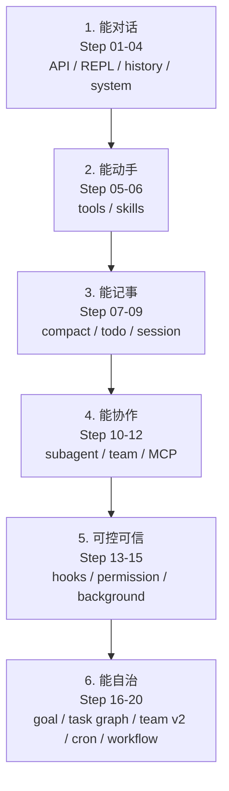

# bc-code-agent Guide：从一次 API 调用到能自己干活

这不是一门“调 prompt”的课，也不是模型训练课。我们要写的是另一半东西：**Harness**。

```text
Agent 产品 = Model + Harness

Model    已经会感知、推理、决策
Harness  给它上下文、工具、记忆、边界和持续运行的方式
```

模型决定什么时候回答、什么时候调用工具、什么时候停止；你写的 Python 决定请求怎么发、工具怎么执行、文件怎么读写、权限怎么拦截、任务怎么恢复。模型是大脑，Harness 是身体和驾驶舱。这个目录教你把身体一件一件装起来。

## 核心模式

所有章节最后都会回到同一个形状：

```text
用户
 ↓
终端 REPL
 ↓
messages[] ──→ LLM ──→ response
                          ↓
                  包含 tool_use block?
                  /              \
                yes               no
                 ↓                 ↓
          执行本地工具          流式输出文本
          追加 tool_result       本轮结束
                 ↓
          回到 messages[]
```

写成代码就是：

```python
def agent_loop(messages):
    while True:
        response = client.messages.create(
            model=MODEL,
            system=SYSTEM,
            messages=messages,
            tools=TOOLS,
        )
        messages.append({"role": "assistant", "content": response.content})

        tool_calls = [
            block for block in response.content
            if block.type == "tool_use"
        ]
        if not tool_calls:
            return

        results = []
        for call in tool_calls:
            output = TOOL_HANDLERS[call.name](**call.input)
            results.append({
                "type": "tool_result",
                "tool_use_id": call.id,
                "content": output,
            })
        messages.append({"role": "user", "content": results})
```

循环属于 Agent，机制属于 Harness。前四章先造最外层的对话循环；Step 5 出现内层工具循环；后面的章节不断往这条链路上加工具、知识、记忆、权限、调度和协作。

## 课程边界

- **会做什么**：从单轮对话开始，逐步做出一个终端 Coding Agent：能读写文件、执行命令、查资料、压缩上下文、恢复会话、派子 Agent、接 MCP、定时触发、跑固定 workflow。
- **不做什么**：不训练模型，不追求生产可用，不模拟 Claude Code 的全部产品细节。
- **参考实现**：`src/bc_code_agent/` 是完整版；`guide/step-*/agent.py` 是教学裁剪版，每章只保留当章机制。
- **安全边界**：涉及 Shell、权限、后台任务的章节必须在临时目录练习。教程代码不是生产安全方案。

## 20 步学习路径

教程编号按学习曲线重排，和主 README 里的实验进度编号不是一一对应。这样可以把 Session 提前到记忆之后，把 Goal 放在权限和后台任务之后，读起来更顺。

| Step | 机制 | 一句话口号 | 解决什么问题 | 状态 |
|---|---|---|---|---|
| [01](./step-01-hello-agent/) | 最小 Agent | 先让模型开口 | Messages API、流式输出 | ✅ |
| [02](./step-02-input-loop/) | 输入循环 | 别让程序只活一次 | 终端 REPL | ✅ |
| [03](./step-03-history/) | 多轮记忆 | 循环不是记忆 | `history` 保存对话 | ✅ |
| [04](./step-04-system-prompt/) | 系统提示词 | 人格写在 system 里 | 身份、风格、行为约束 | ✅ |
| [05](./step-05-tool-loop/) | 工具调用 | 模型伸手，宿主执行 | `tool_use` / `tool_result` 内循环 | ✅ |
| [06](./step-06-skill-loading/) | Skill 加载 | 知识按需展开 | 先目录，后正文 | ✅ |
| [07](./step-07-memory-compact/) | 记忆与压缩 | 上下文总会满 | 原始层、中期层、长期层 | ✅ |
| [08](./step-08-todo/) | Todo | 复杂任务先落清单 | 外部化计划与进度 | ✅ |
| [09](./step-09-session/) | Session | 重启不是失忆 | transcript 落盘与续聊 | ✅ |
| [10](./step-10-subagent/) | 子 Agent | 子任务要独立上下文 | `Task` 委派与摘要返回 | ✅ |
| [11](./step-11-agent-team/) | AgentTeam | 长期协作用邮箱 | 持久队友与消息唤醒 | ✅ |
| [12](./step-12-mcp/) | MCP | 外部能力统一入池 | 动态工具命名与分发 | ✅ |
| [13](./step-13-hooks/) | Hooks | 扩展点不改主循环 | 工具前后与轮次事件 | ✅ |
| [14](./step-14-permission/) | Permission | 先划边界，再给自由 | allow / ask / deny | ✅ |
| [15](./step-15-background/) | Background | 慢命令别堵思考 | 后台执行与完成通知 | ✅ |
| [16](./step-16-goal-loop/) | Goal Loop | 终点必须可验证 | 独立评估器决定能否停 | ✅ |
| 17 | Task 图 | 依赖写成图 | `blockedBy` 与任务落盘 | ⏸ 暂缓 |
| 18 | Team v2 | 并行先隔离工作区 | 原子领取与 worktree | ⏸ 暂缓 |
| [19](./step-19-cron/) | Cron | 到点自己开工 | 定时注入完整 Agent 轮次 | ✅ |
| [20](./step-20-workflow/) | Workflow | 固定路径写进编排 | 内置 registry（YAML 同构）、条件与 journal | ✅ |

## 六个阶段



每个阶段只回答一个问题：

1. **能对话**：怎么把模型的输入输出接到终端？
2. **能动手**：怎么让它安全地碰真实环境？
3. **能记事**：上下文满了、进程重启了怎么办？
4. **能协作**：怎么隔离上下文、共享能力、分工？
5. **可控可信**：怎么拦截危险动作、观察执行、异步等待？
6. **能自治**：什么时候继续跑、什么时候停、固定流程怎么复用？

## 每章怎么读

已写章节的目录固定包含（17/18 暂缓，仅保留索引占位）：

```text
guide/step-01-hello-agent/
  README.md    # 问题 → 解决方案 → 工作原理 → 试一下 → 接下来
  agent.py     # 可独立运行的教学实现
```

阅读方式：

1. 先看 `README.md` 里的“问题”，确认自己理解上一章缺什么
2. 再读“工作原理”，跟着代码块手敲一遍
3. 运行 `agent.py`，对照“试一下”的观察点
4. 最后打开 `src/bc_code_agent/` 里的对应模块，看完整版多处理了哪些边界

不要跳过运行。Agent harness 的很多坑不在架构图里，而在 API 结构、异常、编码、进程和文件系统这些接触面上。

## 快速开始

Python 3.10+：

```bash
pip install -r requirements.txt
```

在项目根创建 `.env`：

```bash
ANTHROPIC_AUTH_TOKEN=your-token
ANTHROPIC_BASE_URL=https://open.bigmodel.cn/api/anthropic
ANTHROPIC_MODEL=glm-5.2
MAX_TOKENS=10000
```

运行第一章：

```bash
python guide/step-01-hello-agent/agent.py
```

Windows 下如果 `python` 找不到依赖，检查是否落在正确的 Python 环境里；本机也可尝试 `py -3.13`。

## 目录约定

```text
guide/
  README.md
  step-01-hello-agent/
    README.md
    agent.py
  step-02-input-loop/
    ...

src/bc_code_agent/
  start.py          # 完整主循环与运行时组装
  file_tools.py     # 语义化文件与 Shell 工具
  memory.py         # 会话、压缩、持久化
  permissions.py    # 权限决策
  subagents.py      # 一次性子 Agent
  team_runtime.py   # 持久队友
  cron.py           # 定时调度
  workflow.py       # 固定编排
```

## 写作原则

1. **一步只加一个机制**。当章代码不提前引入下一章概念。
2. **代码是主角**。解释围绕最小可运行实现展开，不写论文式空转。
3. **跑通才算学会**。每章都有观察点和验收标准。
4. **机制挂回主循环**。每章结尾都说明它从哪里进入 `messages[] → LLM → tools → messages[]` 这条链路。
