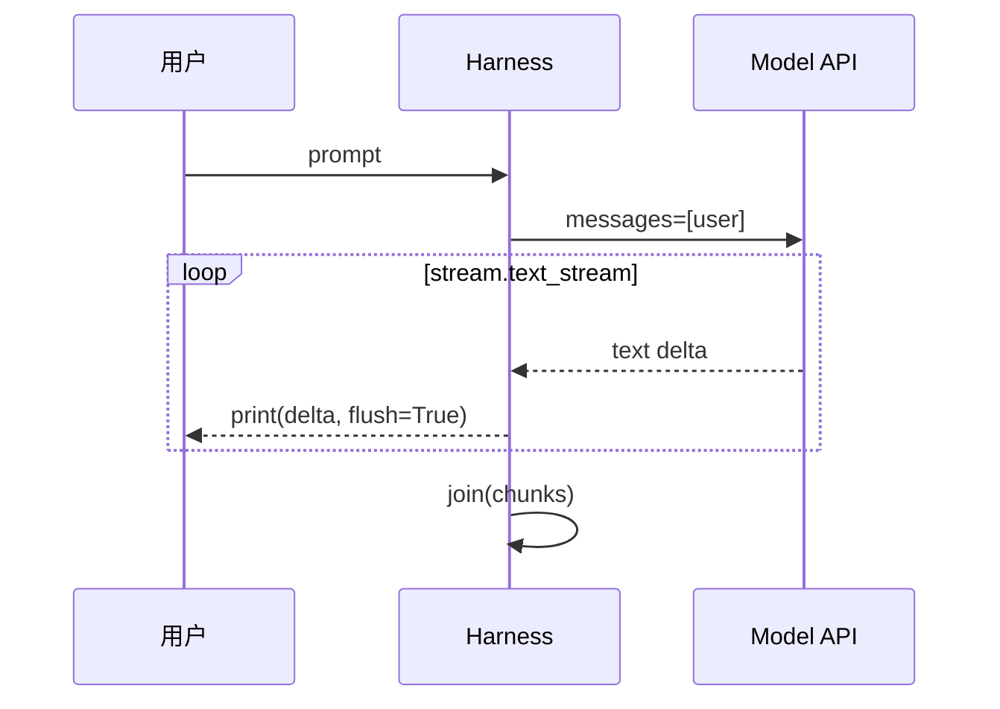

# Step 01 · 最小 Agent：先让模型开口

[Guide](../README.md) · Step 01 → [Step 02](../step-02-input-loop/)

> **口号**：先让模型开口。
>
> **Harness 层**：API 边界——把远端模型接进你的本地进程。

---

## 问题

你有一个 API Key 和一个模型名，但模型本身只是一个远程函数：给它 `messages`，它返回文本。它不知道你的终端，不知道你的文件系统，也不会自己把回答打印出来。

第一章要做的只有一件事：写一个本地宿主程序，把一句话发给模型，再把回答**流式**打到终端。

这是 Agent 的最小骨架。它还没有循环、记忆、工具和权限，但已经有了一个清晰的分工：

```text
模型：生成回答
宿主：管理配置、构造请求、接收增量、渲染终端
```

---

## 解决方案

```text
prompt
  ↓
messages = [{"role": "user", "content": prompt}]
  ↓
client.messages.stream(...)
  ↓
text_stream 逐段返回
  ↓
终端逐字打印
```

完整代码在 [agent.py](./agent.py)。默认用离线 `fake_stream` 演示同一种增量形状；`--real` 才加载 `.env`、创建 Anthropic client 并遍历真实 `text_stream`。这样教程可以在没有 Key 的机器上先跑通宿主结构。

---

## 图示



现在链路里只有一次请求、一次回答。Step 02 会把外面包上 REPL，Step 05 会在模型返回 `tool_use` 时加入内层循环。

---

## 工作原理

### 1. 配置和密钥不进代码

```python
ROOT = Path(__file__).resolve().parents[2]
load_dotenv(ROOT / ".env", override=True)

API_KEY = os.getenv("ANTHROPIC_AUTH_TOKEN") or os.getenv("ANTHROPIC_API_KEY")
BASE_URL = os.getenv("ANTHROPIC_BASE_URL")
MODEL = os.getenv("ANTHROPIC_MODEL", "glm-5.2")
```

`parents[2]` 从 `guide/step-01-hello-agent/agent.py` 回到项目根，保证不管从哪个目录启动，都能找到同一份 `.env`。

`BASE_URL or None` 让同一份代码既能连官方 API，也能连 Anthropic 兼容网关。

### 2. `messages` 是后续一切状态的主角

```python
messages=[{"role": "user", "content": prompt}]
```

Messages API 的对话不是隐式的，而是由你显式维护的消息列表。现在列表里只有一条 user 消息；之后的多轮记忆、人设、工具调用、工具结果、后台通知，都会变成对这一个列表的追加、裁剪和改写。

记住这句话：**Agent 的大部分状态，就活在这个列表里。**

### 3. 流式输出是终端体验的底线

```python
with client.messages.stream(
    model=MODEL,
    max_tokens=MAX_TOKENS,
    messages=[{"role": "user", "content": prompt}],
) as stream:
    for text in stream.text_stream:
        print(text, end="", flush=True)
        chunks.append(text)
```

`messages.create()` 会等完整回答生成完再返回；`messages.stream()` 则边生成边给增量。终端 Agent 必须选后者，否则用户会盯着空屏幕等待十几秒。

这里有两个细节：

- `end=""` 避免每个 token 后换行
- `flush=True` 让文字立刻出现在终端，而不是等缓冲区满了再刷

打印的同时把增量攒进 `chunks`，最后拼成完整回答。Step 03 会把这个返回值写进 `history`，成为多轮记忆的基础。

---

## 试一下

项目根目录执行：

```bash
python guide/step-01-hello-agent/agent.py
python guide/step-01-hello-agent/agent.py --check
python guide/step-01-hello-agent/agent.py --real
```

`--real` 的实跑输出：

```text
我是由Z.ai训练的大型语言模型，也就是你们常说的AI助手。
我可以回答你的问题、帮你写东西、翻译语言，也可以和你一起头脑风暴、出谋划策。

今天你想聊点什么呢？
```

观察点：

1. 文本是逐渐出现的，不是一次性刷出整屏
2. 程序正常退出
3. 修改 `prompt` 变量里的提问，回答会随之变化

## 常见坑

| 现象 | 原因 | 处理 |
|---|---|---|
| `401` | Key 没读到或填错 | 检查 `.env` 的变量名和值 |
| `404` / model not found | 模型名不被网关接受 | 不带 `[1M]` 这类客户端别名 |
| 连接超时 | `ANTHROPIC_BASE_URL` 或网络不通 | 先用 curl 验证网关 |
| `ModuleNotFoundError` | Python 环境不对 | 回项目根安装 requirements，或换正确的 interpreter |
| 中文乱码 | 终端编码问题 | PowerShell 可设 `PYTHONIOENCODING=utf-8` |

---

## 接下来

现在程序一问一答就退出，完全没有 Agent 味。Step 02 会加一个 `while True`，把它变成可以连续输入的终端程序。

但你会遇到一个反直觉的现象：明明在同一个进程里连续聊了好几轮，它却完全不记得上一句。原因藏在每次请求的 `messages` 里，Step 03 再拆。
