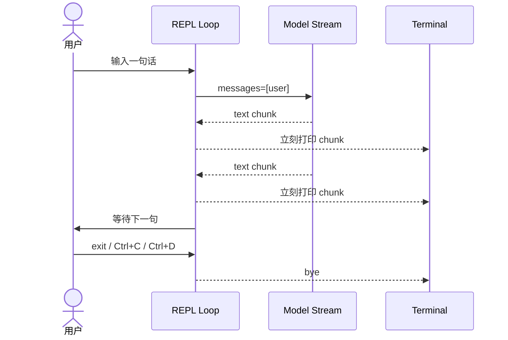

# Step 02 · 输入循环：别让程序只活一次

[Guide](../README.md) · [Step 01](../step-01-hello-agent/) → Step 02 → [Step 03](../step-03-history/)

> **口号**：别让程序只活一次。
>
> **Harness 层**：终端 REPL——把一次 API 调用变成可持续使用的程序。

---

## 问题

Step 01 已经能让模型流式回答，但它只有一条固定的问题。你把问题写死在代码里，程序跑完就退出；想问第二句，只能改代码再跑一遍。

这不像一个工具，更像一次实验。真正的终端 Agent 至少要有一个入口：用户随时输入，程序随时响应，输入结束或用户退出时干净地停掉。

所以本章只加一个机制：`while True`。它不解决记忆，也不调用工具，只负责把“启动一次、回答一次”改成“常驻进程、循环服务”。

---

## 解决方案

完整代码在 [agent.py](./agent.py)。核心只有十几行：

```python
while True:
    try:
        line = read_line()
    except (EOFError, KeyboardInterrupt):
        break

    if is_quit_command(line):
        break

    for chunk in fake_stream(line):
        render(chunk, end="")
```
这里有四个职责：

| 职责 | 归属 | 说明 |
|---|---|---|
| 读取输入 | Harness | 处理 EOF、Ctrl+C、退出命令 |
| 生成回答 | Model | 教学版先用 fake stream 代替 |
| 打印增量 | Harness | 保持 Step 01 的流式体验 |
| 决定是否继续 | Harness | 忽略空行，识别明确退出 |

教学版不依赖 API Key，用 `fake_stream()` 逐段吐出字符串，形状与 `stream.text_stream` 一致。这样你能先把 REPL 的控制流跑通。

---

## 图示



注意最后一格：模型回答完不会让程序退出。真正决定退出的是 REPL 自己。

---

## 工作原理

### 1. `input()` 是这次循环的阻塞点

```python
line = read_line()
```

进程停在 `input()` 时几乎不消耗 CPU。用户按回车后，Harness 才拿到一句话并开始下一轮请求。这个“等待人类”的动作必须由宿主完成，模型自己不会监听终端。

### 2. EOF 和 Ctrl+C 是正常退出，不是崩溃

```python
except (EOFError, KeyboardInterrupt):
    break
```

Ctrl+D 常见在 macOS/Linux，Windows PowerShell 里常用 Ctrl+C。两者都不应该留下 traceback：终端工具被关闭是常态，Agent 的退出路径也应该体面。

### 3. 退出命令和空行要分开

```python
if not line.strip():
    continue
```

空行通常代表误按回车，应该继续等待；`exit`、`quit`、`q` 才是明确退出意图。很多第一版 REPL 把空行当请求发出去，模型只能困惑地回一句“你想问什么？”。

### 4. 循环不是记忆

本章每次调用都只传当前这条 user 消息：

```python
messages=[{"role": "user", "content": line}]
```

所以你接着问“我上一句说了什么”，它也答不上来。这个“缺陷”是刻意保留的：Step 03 会把 `history` 加进来，你会清楚看到记忆不是进程自带的，而是每次请求显式携带的消息列表。

### 5. 换成真实 Anthropic 流式调用

把 `fake_stream()` 替换为：

```python
with client.messages.stream(
    model=MODEL,
    max_tokens=MAX_TOKENS,
    messages=[{"role": "user", "content": prompt}],
) as stream:
    for text in stream.text_stream:
        yield text
```

REPL 本身不用改。能替换的边界越清楚，教学 fake 就越有价值。

如果不需要逐字输出，也可以把同一组参数传给 `client.messages.create()`，再从 `response.content` 中提取文本；本章选择 `stream()` 是为了保住终端反馈。

---

## 试一下

在项目根目录执行：

```bash
python guide/step-02-input-loop/agent.py
```

可以连续输入 `你是谁？`、`现在几点？`、`我刚是谁？`、`exit`。

或者直接跑离线演示：

```bash
python guide/step-02-input-loop/agent.py --demo
```

观察点：

1. 回答逐段出现，程序不退出，继续等你输入
2. 空行只会重新出现提示符
3. 第三问仍然不知道前两问，这证明循环还没有记忆
4. `exit`、Ctrl+C、Ctrl+D 都能干净退出

稳定自检：

```bash
python guide/step-02-input-loop/agent.py --check
```

---

## 常见坑

| 现象 | 原因 | 处理 |
|---|---|---|
| Ctrl+C 打出 traceback | 只捕获了 EOF | 同时处理 `KeyboardInterrupt` |
| 关闭终端后异常 | 忘记 `EOFError` | 捕获后 `break` |
| 空行也请求模型 | 没有过滤空白输入 | `line.strip()` 后继续 |
| 第二问完全失忆 | 每轮只传当前输入 | 这是本章预期，Step 03 解决 |
| 输出一次性出现 | fake 没有分块或没有 flush | 使用 generator，打印时 `flush=True` |
| `--check` 依赖网络 | 把自检写成了真实请求 | 自检只测控制流和数据形状 |

---

## 接下来

现在 REPL 能一直运行，但它只是“每次重新开始”。Step 03 会引入 `history`：追加 user 和 assistant 消息，并把完整列表再次传给模型。你会看到“循环”和“记忆”分别是两层完全不同的 Harness 职责。
