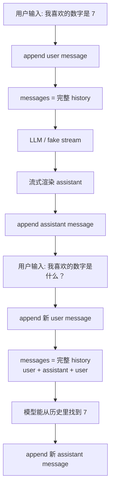

# Step 03 · 多轮记忆：循环不是记忆

[Guide](../README.md) · [Step 02](../step-02-input-loop/) → Step 03 → [Step 04](../step-04-system-prompt/)

> **口号**：循环不是记忆。
>
> **Harness 层**：消息历史——把用户和助手的对话显式带回每一次请求。

---

## 问题

Step 02 的程序已经可以一直运行，但你很快会发现一个反直觉现象：明明是同一个进程，第二问却完全不知道第一问。

原因是 Messages API 没有隐式读取你的进程状态。每次调用都是一次新的推理，模型只能看到这次请求里传来的 `messages`。进程还活着，不等于对话还在场。

所以记忆必须由 Harness 维护：用户发言要追加，助手回答也要追加，下一次请求要把完整列表一起带回去。

---

## 解决方案

完整代码在 [agent.py](./agent.py)。核心状态是一个普通列表：

```python
history: list[Message] = []
```

每一轮做三次追加：

```python
history.append({"role": "user", "content": user_text})
reply = stream_reply(history)
history.append({"role": "assistant", "content": reply})
```

然后下一轮继续把 `history` 传给模型。这里没有数据库、嵌入向量或神秘上下文管理，只有消息列表。

---

## 图示



记忆发生在左侧追加和下一次请求之间。如果只追加 user，不追加 assistant，模型知道你问过什么，却不知道自己答过什么。

---

## 工作原理

### 1. 每轮都传完整 history

```python
def stream_reply(messages: list[Message]) -> Iterable[str]:
    ...
```

真实 API 调用时，不是只传最后一句：

```python
with client.messages.stream(
    model=MODEL,
    max_tokens=MAX_TOKENS,
    messages=messages,
) as stream:
    for text in stream.text_stream:
        yield text
```

这份 `messages` 包含从本轮会话开始以来的 user/assistant 交替记录。

不需要流式时，可将同一组 `system` 与 `messages` 传给 `client.messages.create()`，再从 `response.content` 提取回答；流式版的优势仍是终端能边生成边显示。

### 2. assistant 回答也必须进 history

流式打印只是给人看的，网络返回的 chunk 不会自动进入下一轮。教程代码边打印边拼接：

```python
chunks = []
for text in stream_reply(history):
    print(text, end="", flush=True)
    chunks.append(text)
reply = "".join(chunks)
```

拿到完整回答后再 append。这和 Step 01 攒 `chunks` 的动作一致，只是现在它的结果成了长期状态。

### 3. fake 模型按同一规则读取历史

`fake_stream()` 会扫描 `messages[:-1]` 里用户曾说过的数字。这样不用 API Key 也能验证机制：第一轮存入，第二轮能答，最后再检查消息角色是否正确。

真实模型当然比 fake 强得多，但输入契约完全相同：它看到的也只有这份列表。

### 4. history 是会话内存，不是永久记忆

`history` 挂在 Python 进程里。进程退出，列表就消失；换一个会话，也应该是新的列表。更早的会话持久化、上下文压缩、长期事实抽取，会由后续章节处理。

---

## 试一下

离线演示：

```bash
python guide/step-03-history/agent.py --demo
```

脚本会执行两轮对话（四条消息）：

```text
user: 我喜欢的数字是 7
assistant: 已记住数字 7。
user: 我喜欢的数字是什么？
assistant: 你刚才说你喜欢的数字是 7。
```

交互模式：

```bash
python guide/step-03-history/agent.py
```

可用输入：

```text
我喜欢的数字是 7
我喜欢的数字是什么？
exit
```

稳定自检：

```bash
python guide/step-03-history/agent.py --check
```

观察点：

1. 第二问能答出 7，说明历史被传入了模型调用
2. `history` 的角色按 user / assistant / user / assistant 交替
3. `exit` 后内存历史随进程结束

---

## 常见坑

| 现象 | 原因 | 处理 |
|---|---|---|
| 第二问失忆 | 仍只传当前输入 | 每次传完整 `history` |
| 模型重复扮演用户 | 没追加 assistant | 流式结束后 append 完整回答 |
| 上下文越来越贵 | 历史无限增长 | 后续 Step 07 做压缩 |
| 一次失败也写入历史 | 请求中途异常 | 只有拿到完整回答才 append |
| 把说明混进 messages | 用 user 消息冒充规则 | 身份和规则放到 Step 04 的 system |
| 重启后以为还能记得 | 混淆内存与持久化 | Step 09 再做 session |

---

## 接下来

现在对话能记住事实，但身份和行为规则还只能靠每条 user 消息重复提醒。Step 04 会把它们提升到请求顶层的 `system` 字段，让身份、风格和约束离开用户/助手消息流。
