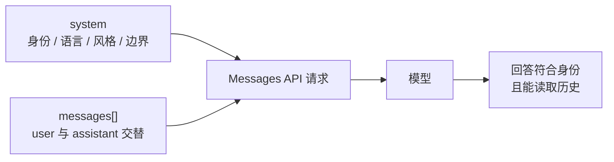

# Step 04 · 系统提示词：人格写在 system 里

[Guide](../README.md) · [Step 03](../step-03-history/) → Step 04 → [Step 05](../step-05-tool-loop/)

> **口号**：人格写在 system 里。
>
> **Harness 层**：系统提示词——在用户和助手之外定义身份与规则。

---

## 问题

有了 REPL 和 history，对话已经像样了。但如果你想让 Agent 始终用中文、保持简短、偏保守、不自称人类，现在只能不断在用户消息里提醒它。

这会污染对话记录：规则看起来像用户临时要求，历史越长越容易被忽略，而且每次构造请求都要重复拼接。

身份、风格和安全边界不是某一轮用户说的话，应该放在请求顶层的 `system` 字段里。

---

## 解决方案

完整代码在 [agent.py](./agent.py)。请求分成两块：

```python
system = "你是 BC Guide，用中文回答，每轮最多两句话。"
messages = [{"role": "user", "content": prompt}]
```

调用时顶层字段分开传：

```python
fake_stream(system=system, messages=messages)
```

换成真实 API：

```python
with client.messages.stream(
    model=MODEL,
    max_tokens=MAX_TOKENS,
    system=system,
    messages=messages,
) as stream:
    for text in stream.text_stream:
        yield text
```

`system` 是每轮都携带的稳定契约；`messages` 是随会话增长的对话记忆。

不需要流式时，同样把顶层 `system` 和 `messages` 传给 `client.messages.create()`，再读取 `response.content`；流式与非流式在请求结构上没有区别。

---

## 图示



如果把 system 写进 messages，就像把宪法塞进每封来信里；顶层 system 则更像整场会议的主持规则。

---

## 工作原理

### 1. system 不进入消息流

教学实现断言：

```python
assert all("system" not in message for message in agent.messages)
```

这不是格式洁癖。保持 `messages` 只包含 user/assistant 交替，后续追加 tool_use、tool_result 时结构才不会越搅越乱。

### 2. system 每次请求都要传

它不是设置一次就永久生效的进程开关。进程里的 `Agent.system` 只是保存字符串；真正让模型看到它的是每次 API 调用。

```python
self.system = system
...
for chunk in fake_stream(system=self.system, messages=self.messages):
    ...
```

### 3. system 可以被 Harness 组装

真实 Agent 常常把项目路径、当前时间、可用工具规范、安全策略拼接进 system。示例保持最小：

```python
DEFAULT_SYSTEM = (
    "你是 BC Guide，一个终端编程助教。"
    "用中文回答，每轮最多两句话。"
)
```

后半套教程会继续扩展这层组装，但原则不变：稳定身份和全局规则优先放 system。

### 4. system 不是记忆

同一个 system 下新建一个 Agent，它仍然不知道上一个实例的 history。教学演示会对比默认 Agent 和严格 Agent：默认 Agent 记得用户叫小王，严格 Agent 面对同样问题时没有这段历史。

---

## 试一下

离线演示：

```bash
python guide/step-04-system-prompt/agent.py --demo
```

演示会先让默认 Agent 记住“我叫小王”，再创建一个使用严格 system 的 Agent 问同样的问题。你会看到：system 可以改变行为，但不能替代历史。

交互模式：

```bash
python guide/step-04-system-prompt/agent.py
```

可用输入：

```text
我叫小王
我是谁？
用一句话解释 system prompt
exit
```

稳定自检：

```bash
python guide/step-04-system-prompt/agent.py --check
```

观察点：

1. 同一个 Agent 能用 history 记住小王
2. 所有回答都受顶层 system 约束
3. `agent.messages` 里没有任何 `role=system`
4. 换 system 不等于换记忆

---

## 常见坑

| 现象 | 原因 | 处理 |
|---|---|---|
| 规则经常失效 | 埋在很长的 user 消息里 | 移到顶层 `system` |
| messages 结构混乱 | 把 system 塞进消息列表 | system 永远作为顶层字段 |
| 改了字符串没生效 | 忘记下次调用仍要传 | 每次请求都传 `system` |
| system 写成几百行 | 什么都往里塞 | 只放稳定身份和全局规则 |
| 泄漏密钥或私有路径 | 动态拼接 system 不加边界 | 只注入必要、可信的环境信息 |
| 以为 system 能记住事实 | 混淆规则与历史 | 记忆仍靠 `messages` |

---

## 接下来

外层对话三件事已经齐了：能持续输入、能记住对话、有稳定人格。但模型仍然只能“说”，不能“做”。Step 05 将加入工具调用：模型输出 `tool_use`，宿主执行工具，再把 `tool_result` 追回 messages。
