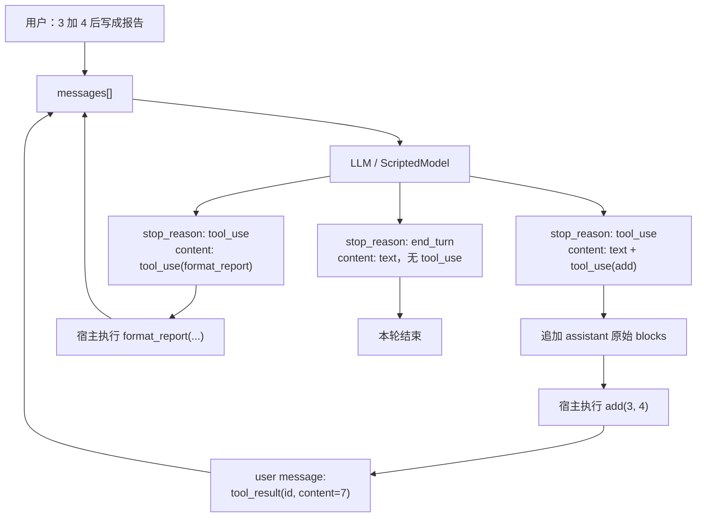

# Step 05 · 工具调用：模型伸手，宿主执行

[Guide](../README.md) · [Step 04](../step-04-system-prompt/) → **Step 05** → [Step 06](../step-06-skill-loading/)

> **口号**：模型伸手，宿主执行。
>
> **Harness 层**：工具边界——把模型的结构化意图变成本地函数调用，再把结果送回上下文。

---

## 问题

前四章的 Agent 已经能连续对话、记住上一轮、带上固定人设，但它仍然只是一个会说话的终端。你问“3 加 4 等于几”，它只能靠模型自己算；你问“这个文件有多少行”，它更是没有任何可靠途径知道答案。

真正让程序有 Agent 味的转折点不是 prompt，而是这一件事：**允许模型请求宿主执行工具**。

这里最容易误解的是：模型并不能直接执行 `add()`。它返回的是一个结构化的 `tool_use` block，相当于说：“请用我给出的参数调用 `add`。”真正打开进程、读写文件、算数、查数据库的人，永远是你的 Python Harness。

---

## 解决方案

这一章给模型两个极小的工具：

- `add(a, b)`：把两个整数相加
- `format_report(value, title)`：把数字渲染成一行报告

然后加入内层工具循环：

```python
def agent_loop(model, messages):
    while True:
        response = model.messages_create(messages=messages)
        messages.append(to_assistant_message(response))

        tool_calls = [b for b in response.content if b.type == "tool_use"]
        if not tool_calls:
            return final_text(response)

        results = []
        for call in tool_calls:
            output = execute_tool(call.name, call.input)
            results.append({
                "type": "tool_result",
                "tool_use_id": call.id,
                "content": output,
            })
        messages.append({"role": "user", "content": results})
```

注意循环的停止条件：**响应里有 `tool_use`，执行完并把结果回填后继续；没有 `tool_use`，本轮结束。**这就是最小工具循环。

为了让你不用 API Key 也能看到完整消息形态，`agent.py` 里的 `ScriptedModel` 会按剧本返回三次响应：

1. 请求调用 `add(3, 4)`
2. 根据结果请求调用 `format_report(7, "库存")`
3. 返回最终文本，循环停止

---

## 图示



这张图的关键不是 `add`，而是那条从 `tool_result` 回到 `messages[]` 的边。工具结果不是打印到终端就结束了，它必须进入下一次请求的上下文。

---

## 工作原理

### 1. 工具先被声明成 API schema

真实 Anthropic API 使用 `tools` 参数，每个工具包含 `name`、`description` 和 JSON Schema 格式的 `input_schema`：

```python
TOOLS = [
    {
        "name": "add",
        "description": "Add two integers.",
        "input_schema": {
            "type": "object",
            "properties": {"a": {"type": "integer"}, "b": {"type": "integer"}},
            "required": ["a", "b"],
        },
    }
]
```

`name` 是协议里的工具名，`description` 告诉模型什么时候选它，`input_schema` 约束参数结构。教学版没有联网，但保留了同样的 schema 形状，方便你之后直接替换成 `anthropic.Anthropic().messages.create(..., tools=TOOLS)`。

### 2. 模型返回的是 content blocks

一次 assistant 响应可能同时包含文本和多个 `tool_use` block：

```python
FakeContent(type="text", text="我先计算合计。")
FakeContent(type="tool_use", id="toolu_add_01", name="add", input={"a": 3, "b": 4})
```

真实 SDK 中它们是 `TextBlock` 和 `ToolUseBlock` 对象。每个 `tool_use.id` 都必须被宿主记住，因为下一次回填结果时要靠它一一对应。

### 3. `stop_reason` 和停止条件要配合看

真实 API 常见两种情况：

- `response.stop_reason == "tool_use"`：模型请求工具，通常响应里有 `tool_use` block
- `response.stop_reason == "end_turn"`：模型认为可以直接回答，通常没有 `tool_use` block

教学循环以 `tool_use` block 作为核心判断：有就执行并继续，没有就停止。这和本项目完整实现的做法一致，比只看 `stop_reason` 更贴近消息实际内容；`stop_reason` 则适合作为调试和防御性校验。

### 4. `tool_result` 是一条 user message

宿主执行完工具后，不是直接修改 assistant 消息，而是追加一条新的 `user` 消息：

```python
{
    "role": "user",
    "content": [
        {"type": "tool_result", "tool_use_id": call.id, "content": output}
    ],
}
```

这是 Anthropic Messages API 的约定：assistant 请求工具，下一轮 user 消息携带对应 `tool_result`。如果 assistant 里有多个 `tool_use`，就要为每个 `id` 都提供结果；即使工具执行失败，也应该返回错误文本，而不是让结果缺失。

### 5. 消息保存的是 blocks，不只是回答文本

`response.stop_reason` 不需要追加进 `messages`。真正必须保存的是 assistant 的 `content` blocks，因为其中的 `tool_use.id` 要和后续 `tool_result.tool_use_id` 配对。压缩或裁剪上下文时，也不能只留下漂亮文本而拆散这一对。

---

## 试一下

在项目根目录运行：

```bash
py -3.13 guide/step-05-tool-loop/agent.py
```

你会看到每轮的 `stop_reason`、工具调用和结果回填：

```text
turn 1 stop_reason=tool_use
  tool_use add({'a': 3, 'b': 4})
  tool_result 7
turn 2 stop_reason=tool_use
  tool_use format_report({'value': 7, 'title': '库存'})
  tool_result 库存: 7
turn 3 stop_reason=end_turn
final answer: 库存: 7
```

再跑自检：

```bash
py -3.13 guide/step-05-tool-loop/agent.py --check
```

自检会验证：

1. 循环恰好调用三次模型
2. 每个 `tool_use.id` 都有匹配的 `tool_result.tool_use_id`
3. 每次工具请求之后，下一条消息都是携带结果的 user message
4. 最终响应没有 `tool_use`，循环正常退出

---

## 常见坑

| 现象 | 原因 | 处理 |
|---|---|---|
| API 报 tool result 缺失 | 只保存了回答文本，丢掉 `tool_use` block | assistant 原始 blocks 必须进 `messages` |
| 模型重复调用同一个工具 | 结果没有作为 `tool_result` 回填 | 工具结果要追加 user message 后再请求 |
| `id` 对不上 | 自己重新生成或覆盖了 `tool_use_id` | 原样使用模型的 `tool_use.id` |
| 一次响应多个工具只返回一个结果 | 以为一次只能有一个调用 | 遍历全部 `tool_use`，逐个回填 |
| 工具异常后循环崩掉 | 把异常和协议错误混在一起 | 捕获后把错误文本作为 `tool_result` 返回 |

---

## 接下来

现在模型能伸手了，但每轮请求都会带上全部工具说明。如果还有 React 规范、SQL 风格、发布流程这类长文档，把它们全部塞进 system prompt 会迅速吃掉上下文。

[Step 06](../step-06-skill-loading/) → 只把技能目录给模型，正文等它真正需要时再通过 `LoadSkill` 展开。
