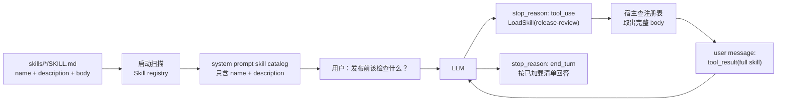

# Step 06 · Skill 加载：知识用到时再展开

[Guide](../README.md) · [Step 05](../step-05-tool-loop/) → **Step 06** → [Step 07](../step-07-memory-compact/)

> **口号**：先给目录，正文按需展开。
>
> **Harness 层**：知识边界——用最小元数据帮模型发现技能，用 `LoadSkill` 在需要时加载完整说明。

---

## 问题

有了工具循环以后，你想给 Agent 加一套“发布前检查规范”。很快又会有 SQL 风格指南、代码评审清单、客户项目术语表。最直接的写法是把所有文档全文塞进 system prompt：

```python
SYSTEM = (
    "You are a coding agent.\n"
    + open("skills/release-review/SKILL.md").read()
    + open("skills/sql-style/SKILL.md").read()
)
```

这样模型确实每次都看得见所有规范，但代价也很直接：不管用户问的是发布、SQL 还是命名，三份正文都会进入每一次请求。输入 token 变大只是表面问题，更重要的是上下文被无关知识占满，工具结果和用户对话的空间随之变少。

Skill 机制要解决的是这个选择问题：**模型必须知道有哪些技能，但不需要一直持有所有正文。**

---

## 解决方案

把每个 Skill 拆成两层：

| 层 | 内容 | 放在哪里 | 何时进入模型 |
|---|---|---|---|
| 目录层 | `name` + `description` | system prompt | 启动时就存在 |
| 正文层 | 完整 `SKILL.md` body | 本地注册表 | 模型调用 `LoadSkill(name)` 后 |

教学版用三个内存 Skill 模拟磁盘上的 `skills/*/SKILL.md`：

```python
SKILLS = {
    "release-review": Skill(
        name="release-review",
        description="Checklist before publishing a Python package.",
        body="发布前：\n1. 跑完整测试\n2. 更新 changelog\n...",
    ),
    "sql-style": Skill(...), "domain-terms": Skill(...),
}
```

启动时生成的 system prompt 里，技能目录只包含：

```text
Available skills:
- release-review: Checklist before publishing a Python package.
- sql-style: Write conservative SQL and explain destructive statements.
- domain-terms: Explain product vocabulary used by this workspace.
```

模型判断当前任务是发布检查时，才返回 `LoadSkill("release-review")` 的工具请求。宿主从注册表取正文，并作为 `tool_result` 回填。下一轮模型读到完整步骤，再继续执行或总结。

---

## 图示



渐进披露的分界线在 `catalog_prompt()` 和 `view()` 之间：前者只允许输出目录元数据，后者才允许输出正文。

---

## 工作原理

### 1. Skill 目录只暴露两个字段

教学版把 Skill 存在内存里；完整实现会扫描 `skills/<name>/SKILL.md`，解析 YAML frontmatter：

```markdown
---
name: release-review
description: Checklist before publishing a Python package.
---

# Release Review

发布前先跑完整测试，再更新 changelog。
```

扫描结果保存在注册表里，但 system prompt 的技能目录只渲染 `name` 和 `description`。这样模型能做“这个任务和哪个技能相关”的判断，却不会提前消耗所有正文 token。

### 2. `LoadSkill` 只是一个普通工具

真实 Anthropic API 的声明方式如下：

```python
TOOLS = [
    {
        "name": "LoadSkill",
        "description": "Load full skill content by name before following it.",
        "input_schema": {
            "type": "object",
            "properties": {"name": {"type": "string", "description": "Exact name."}},
            "required": ["name"],
        },
    },
]
```

模型不会自动知道这是特殊工具。它看到 system prompt 里的目录和工具描述，才会在任务匹配时返回：

```python
FakeContent(type="tool_use", id="toolu_skill_01", name="LoadSkill",
            input={"name": "release-review"})
```

真实 SDK 中这个 block 同样会伴随 `response.stop_reason == "tool_use"`，由 Step 05 的内层循环统一处理。

### 3. 正文通过 `tool_result` 回填

宿主执行：

```python
output = load_skill("release-review")
```

然后追加：

```python
{
    "role": "user",
    "content": [
        {"type": "tool_result", "tool_use_id": "toolu_skill_01", "content": output}
    ]
}
```

这里复用的正是 Step 05 的工具循环。Skill 的特别之处不在协议，而在数据结构：目录进 system，正文进 `tool_result`。

### 4. 未命中时返回可纠正的信息

`name` 是注册表键，不是文件路径。用户或模型传错时，宿主返回已知技能列表，让下一轮模型有机会重新选择：

```text
Skill not found: 'release'. Known: domain-terms, release-review, sql-style
```

这比直接抛异常更适合 Agent 场景，因为工具错误本身可以成为模型纠错的上下文。

---

## 试一下

在项目根目录运行：

```bash
py -3.13 guide/step-06-skill-loading/agent.py
```

观察输出：

1. `system prompt` 中的技能目录只有三个名称和描述（另有固定身份与调用规则）
2. 第一轮模型响应的 `stop_reason` 是 `tool_use`
3. `LoadSkill` 的结果包含完整发布检查清单
4. 下一轮模型返回最终文本，循环停止

再运行协议自检：

```bash
py -3.13 guide/step-06-skill-loading/agent.py --check
```

自检会验证：

- `LoadSkill("release-review")` 能取回完整正文
- 未知名称会返回已知技能列表，而不是崩溃
- `tool_use_id` 和 `tool_result.tool_use_id` 一一匹配

---

## 常见坑

| 现象 | 原因 | 处理 |
|---|---|---|
| token 仍然暴涨 | catalog 里顺手拼了 body | 目录层只允许 `name + description` |
| 模型臆造技能步骤 | 描述太像答案，却没要求先加载 | system 明确写“先 LoadSkill，再执行” |
| 未知技能后循环崩掉 | 注册表 miss 直接抛异常 | 返回错误和已知列表作为 `tool_result` |
| 加载后下一轮仍不遵守 | 只打印正文没有回填 | 完整 body 必须进入 `tool_result` |

---

## 接下来

`LoadSkill` 解决了“先目录后正文”，但一旦技能被加载，它就成了 `messages[]` 里的长内容。随着工具结果越攒越多，上下文最终会满。

[Step 07](../step-07-memory-compact/) → 给对话加压缩层：哪些信息必须保留，哪些可以降级成摘要。
