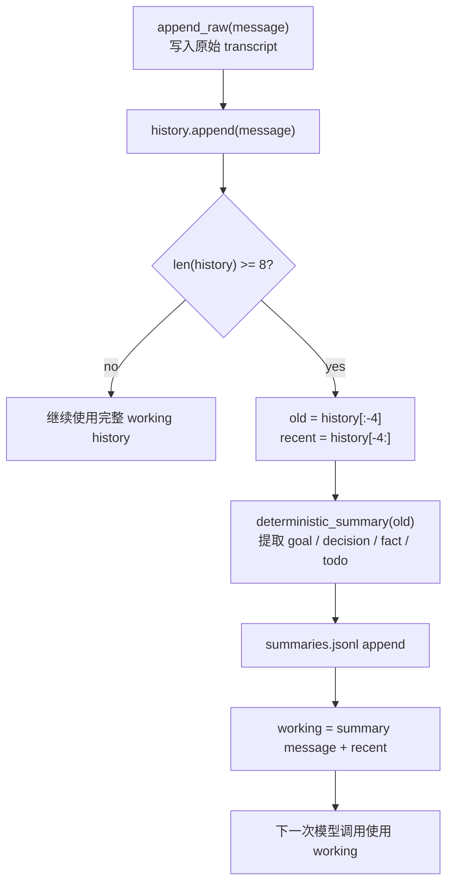

# Step 07 · Memory Compact：上下文满了怎么办

[Guide](../README.md) · [Step 06](../step-06-skill-loading/) → Step 07 → [Step 08](../step-08-todo/)

> **口号**：原始记录不丢，工作窗口变小。
>
> **Harness 层**：Memory Compact 管理当前会话的上下文预算。

---

## 问题

Agent 每读一个文件、跑一次测试、回答一个问题，都会往 `messages[]` 里追加内容。上下文窗口不是无限大的：任务越长，历史越大，最后要么成本高得离谱，要么请求直接被模型拒绝。

更麻烦的是，不能简单删掉前半段。旧历史里可能有：

- 用户真正想要的目标
- 已经做过的决定
- 不能违反的约束
- 还没做完的事项

如果直接裁掉，Agent 会重复劳动，甚至把已经否决的方案再做一遍。

---

## 解决方案

把“保存什么”和“发送什么”拆成两层：

```text
原始层 transcript.jsonl   只追加，保存完整历史
工作层 messages[]          只保留摘要 + 最近消息，发给模型
```

当 `len(history) >= 8` 时触发 compact：

1. 前 4 条交给确定性摘要函数
2. 摘要写入 `summaries.jsonl`
3. 保留后 4 条原始消息
4. 新 working history 变成 1 条摘要消息 + 4 条近期消息

完整代码在 [agent.py](./agent.py)。本章不调用 API，摘要函数只识别 `goal:`、`decision:`、`fact:`、`todo:` 这些标记行，让压缩结果可以被准确断言。

---

## 图示



关键区别在图中右侧的两次落盘：`transcript.jsonl` 是事实档案，`summaries.jsonl` 是可检索的状态层；`messages[]` 只是下一次请求的工作副本。

---

## 工作原理

### 1. 原始层只追加

```python
def append_raw(self, message):
    with self.transcript_path.open("a", encoding="utf-8") as file:
        file.write(json.dumps(message, ensure_ascii=False) + "\n")
```

压缩不能改写档案。哪怕摘要错了，也要能回到原始 transcript 排查。这也是为什么本章先写 `append_raw()`，再考虑裁剪 working history。

### 2. 触发阈值要和单位一致

```python
COMPACT_THRESHOLD = 8
KEEP_RECENT = 4
```

教学版用消息条数触发，优点是演示稳定。生产实现通常用 token 数或序列化字符数估算，因为一条消息里可能是一个短问题，也可能是几十 KB 的测试日志。

无论用什么单位，判断和压缩必须使用同一套口径，否则会出现“触发条件说满了，压缩后仍然超限”的循环。

### 3. 摘要是状态，不是聊天记录缩写

```python
return SegmentSummary(
    segment=segment,
    goals=_dedupe(buckets["goal"]),
    decisions=_dedupe(buckets["decision"]),
    facts=_dedupe(buckets["fact"]),
    open_todos=_dedupe(buckets["todo"]),
)
```

好的 compact 摘要回答“当前任务在什么状态”，不是把每句话变短。本章的确定性函数只保留四类信息，方便测试：

| 字段 | 保留什么 | 例子 |
|---|---|---|
| `goals` | 仍在追求的目标 | 修复登录页移动端布局 |
| `decisions` | 已经拍板的选择 | 保持现有视觉稿 |
| `facts` | 后续会用到的事实 | 相关测试文件路径 |
| `open_todos` | 未完成事项 | 补回归测试 |

### 4. working history 以摘要消息开头

```python
working = [
    {"role": "user", "content": summary.to_prompt()},
    *recent,
]
```

摘要消息使用 `role=user`，因为它是宿主注入的资料，不是模型曾经说过的回答。后 4 条保持原始顺序，让模型能看到最近的工具结果和当前工作细节。

生产版还要额外保护工具调用结构：`assistant(tool_use)` 和对应的 `user(tool_result)` 不能被切开。本章历史只有文本消息，所以先把最小机制讲清楚。

---

## 试一下

项目根目录执行：

```bash
py -3.13 guide/step-07-memory-compact/agent.py
```

预期输出要点：

```text
raw transcript: 8 messages
summaries: 1
working history: 5 messages (compacted=True)

[Memory Summary #1]
- goal: 修复登录页在移动端的布局
- decision: 先复现 375px 宽度下的问题
- fact: 失败原因是按钮容器没有设置最小宽度
- open todo: 补充移动端回归测试
```

运行验收：

```bash
py -3.13 guide/step-07-memory-compact/agent.py --check
```

`--check` 会在临时目录里验证：原始层 8 条、摘要层 1 条、working history 5 条、近期消息未被改写、四类摘要字段完整。退出码为 0 即通过。

---

## 常见坑

| 现象 | 原因 | 处理 |
|---|---|---|
| 压缩后模型忘记目标 | 摘要只缩写对话，没有提取目标 | 摘要字段必须包含 goal 和约束 |
| 压缩后请求仍超限 | 条数阈值不代表 token 大小 | 生产版按 token 或字符预算触发 |
| 工具调用报协议错误 | 裁剪时切开了 tool_use / tool_result | 裁剪边界要修复完整工具轮次 |
| 摘要错误无法排查 | 只保存压缩结果 | 原始 transcript 必须先落盘 |
| 每轮重复压缩 | 摘要消息又被当成旧历史重复处理 | 给 segment 编号并合并旧摘要 |
| 模型执行历史里的指令 | 把摘要当普通聊天内容注入 | 明确 summary 是参考资料，当前用户请求优先 |

---

## 接下来

compact 解决的是“长任务还能装进上下文”，但 Agent 做复杂任务时还需要一个显式计划：现在做哪一步，哪些做完，哪些待办。Step 08 会实现最小 TodoStore，并用整表更新保证状态一致。
