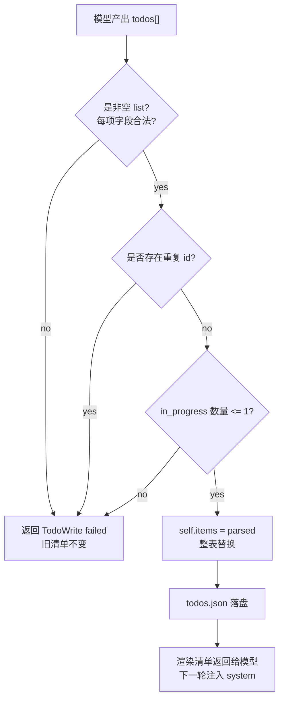

# Step 08 · Todo：复杂任务先落清单

[Guide](../README.md) · [Step 07](../step-07-memory-compact/) → Step 08 → [Step 09](../step-09-session/)

> **口号**：计划是状态，不是一段聊天文本。
>
> **Harness 层**：Todo 把任务进度外部化，防止长任务迷路。

---

## 问题

让 Agent 做“重构认证模块、跑测试、修复失败”这类多步任务时，它很容易在测试失败后进入局部战场：修第 3 个断言，忘了原本还有文档要更新、权限边界要检查。

把 TODO 写在对话里不够可靠。上下文一长，旧计划的影响力会下降；compact 之后，它还可能被摘要掉。计划需要成为宿主维护的结构化状态，每轮都能明确注入。

---

## 解决方案

实现一个最小 `TodoStore`：

1. 每个事项有稳定 `id`、`content`、`status`
2. 每次工具调用提交完整清单，校验通过后整表替换
3. 最多只允许一个 `in_progress`
4. 成功更新后写入 `todos.json`
5. 失败更新不改变旧状态

完整代码在 [agent.py](./agent.py)。本章不执行真实工具，只用四次清单更新演示状态迁移和非法输入。

---

## 图示



注意 `C` 是同一种结果：任何校验失败都发生在替换之前。这个顺序保证了坏输入不会污染已有计划。

---

## 工作原理

### 1. 全量更新，不做隐式 patch

```python
self.items = parsed
self._save()
return self.read()
```

模型每次都提交完整列表，而不是只说“把第 2 项改成完成”。这样有两个好处：

- 请求自带最终状态，减少“更新第几项”的歧义
- 校验可以看到整份计划，检查唯一 `in_progress`

代价是每次输出略多。对几十项以内的会话计划，这个代价远低于状态错乱的修复成本。

### 2. 稳定 ID 是状态迁移的关键

```python
item_id = str(raw.get("id") or "").strip() or f"t{index + 1}"
```
如果只靠内容匹配，模型微调一句话就会把旧事项当成新事项。稳定 ID 让“同一件事”在 pending、in_progress、completed 之间迁移，也让用户和 Agent 能准确讨论某一项。

### 3. 唯一 in_progress 是硬约束

```python
if in_progress > 1:
    return "TodoWrite failed: at most one item may be in_progress."
```

这个限制不是模型能力问题，而是执行策略：单线程 Agent 同一时刻只应有一个当前事项。若确实要并行，需要后续章节的子 Agent 或任务图，而不是在普通 TODO 里悄悄放两个进行中。

### 4. 落盘和恢复

`todos.json` 保存的是普通 JSON 数组：

```json
[
  {
    "id": "analyze",
    "content": "分析现有权限入口",
    "status": "completed"
  }
]
```

重新构造 `TodoStore` 时会读取这份文件。生产实现还会处理损坏文件、并发写入和备份；教学版只保留“成功更新原子替换内存列表，再保存文件”的主路径。

---

## 试一下

项目根目录执行：

```bash
py -3.13 guide/step-08-todo/agent.py
```

你会看到四次更新：

```text
initial:
Todo (0/3 completed):
[ ] analyze: 分析现有权限入口 (pending)

start analyze:
Todo (0/3 completed):
[>] analyze: 分析现有权限入口 (in_progress)

invalid update:
TodoWrite failed: at most one item may be in_progress.

valid update:
Todo (1/3 completed):
[x] analyze: 分析现有权限入口 (completed)
[>] write: 写权限判断函数 (in_progress)
```

运行验收：

```bash
py -3.13 guide/step-08-todo/agent.py --check
```

`--check` 会在临时目录验证：合法更新写入 JSON、重新加载后状态一致、两个 `in_progress` 被拒绝、重复 ID 被拒绝且旧清单不变。

---

## 常见坑

| 现象 | 原因 | 处理 |
|---|---|---|
| 清单越更新越乱 | 只做局部 patch，缺少最终状态 | 使用全量替换 |
| 同一事项反复出现 | 用内容当身份 | 给每个事项稳定 ID |
| 多个事项同时进行 | 没约束 `in_progress` | 校验最多一个 |
| 非法请求清空计划 | 先替换再校验 | 校验通过才赋值 |
| 重启后计划丢失 | TODO 只存在内存 | 成功更新后落盘 |
| TODO 变成愿望清单 | 事项太大或没有完成条件 | 每项写成可验证的小步骤 |

---

## 接下来

TODO 解决了会话内的计划状态，但进程退出后对话本身仍然会消失。Step 09 会把每条消息追加到 `transcript.jsonl`，保存 `working.json`，并用 `--session` 恢复同一个会话。
