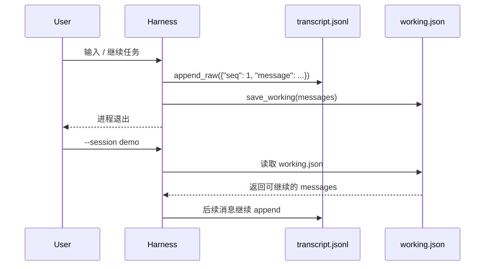

# Step 09 · Session：重启不是失忆

[Guide](../README.md) · [Step 08](../step-08-todo/) → Step 09 → [Step 10](../step-10-subagent/)

> **口号**：transcript 是档案，working 是快照。
>
> **Harness 层**：Session 让同一个会话可以跨进程恢复。

---

## 问题

进程一旦退出，内存里的 `messages[]` 就消失了。用户下一次说“继续刚才那个任务”，Agent 却不知道刚才是什么：目标、已读文件、工具结果、TODO 状态都没有了。

把所有历史原样塞进下次请求也不是答案。真实会话可能已经经过 compact，直接从完整 transcript 重建会绕过压缩结果，还可能恢复出 API 不接受的不完整工具轮次。

---

## 解决方案

每个会话拥有一个目录：

```text
sessions/<session_id>/
  transcript.jsonl   事件档案：每条消息到达时追加
  working.json       请求快照：本轮真正要恢复的 messages
```

启动语义很简单：

- 不带 `--session`：生成新的 session id
- 带 `--session demo`：打开 `guide/sessions/demo/`，恢复 working history
- `working.json` 缺失时：从 `transcript.jsonl` 重建

完整代码在 [agent.py](./agent.py)。不带 `--session` 时使用临时目录；带 `--session demo` 时会保留在 `guide/sessions/demo/`，可以真的跨进程恢复。

---

## 图示



如果 `working.json` 不存在，读取箭头会退到 `transcript.jsonl`。这不是双写冗余，而是两类职责：一个负责事实归档，一个负责恢复当前工作状态。

---

## 工作原理

### 1. session id 是目录边界

```python
if not re.fullmatch(r"[A-Za-z0-9_.-]+", session_id):
    raise ValueError(f"invalid session id: {session_id!r}")
```

session id 会进入文件路径，所以不能接受 `../escape` 这类值。校验通过后，同一个 id 总是映射到同一个目录。

默认 id 由时间和短随机数组成：

```python
f"{datetime.now():%Y%m%d-%H%M%S}-{uuid.uuid4().hex[:4]}"
```

### 2. transcript 只追加

```python
record = {
    "seq": sequence,
    "ts": datetime.now().isoformat(timespec="seconds"),
    "message": message,
}
```

`seq` 让档案可排序、可审计；`ts` 只表示宿主记录时间，不参与恢复排序。追加写入避免半覆盖文件：即使最后一行损坏，前面的记录仍然可读。

### 3. working history 是显式快照

```python
payload = {
    "session_id": self.session_id,
    "updated_at": ...,
    "messages": messages,
}
```

`messages` 是当时准备发给模型的 working history。若上一章 compact 已经把它变成“摘要 + 近期消息”，这里保存的就是压缩后的版本。重启时优先读取它，不会把旧历史重新展开。

### 4. `--session` 是恢复入口

```bash
py -3.13 guide/step-09-session/agent.py
py -3.13 guide/step-09-session/agent.py --session demo
```

第一条命令生成新的临时会话；第二条命令显式指定 `guide/sessions/demo/`。首次运行会写入演示数据，再次运行会从 `working.json` 恢复。生产实现还会校验目录是否存在、列出可用会话、处理 API 消息块的合法性。教学版把这些边界缩到最小，只保留 id、append、snapshot、restore 四件事。

---

## 试一下

项目根目录执行：

```bash
py -3.13 guide/step-09-session/agent.py
```

预期输出：

```text
session id: <new-id>
created: new session saved
transcript records: 4
restored working history: 4 messages
restore ok: True
```

运行验收：

```bash
py -3.13 guide/step-09-session/agent.py --check
```

`--check` 会在同一个临时目录里模拟重启：先写入 4 条 transcript 和 working 快照，再重新打开 `check-session` 恢复；随后删除 `working.json`，验证能从 transcript 重建，并确认路径穿越型 session id 会被拒绝。

---

## 常见坑

| 现象 | 原因 | 处理 |
|---|---|---|
| 恢复后绕过了 compact | 从完整 transcript 原样重建 | 优先恢复 `working.json` |
| transcript 只剩摘要 | 把 working 快照当档案覆盖 | archive 和 snapshot 分开保存 |
| API 拒绝恢复消息 | assistant tool_use 没有对应 result | 恢复前修复不完整工具轮次 |
| 会话目录互相污染 | session id 未校验就拼路径 | id 只允许安全字符 |
| 两个进程同时 append | JSONL 追加也不等于并发安全 | 生产版加锁或单写者 |
| 用户误恢复旧任务 | 所有旧会话都能继续 | 提供列表、预览和确认 |

---

## 接下来

现在单个会话可以恢复，但长任务里的独立调查仍会挤占同一个上下文。Step 10 会引入子 Agent：给它一个全新 `messages[]`，让它完成子任务后只把结论带回父会话。
