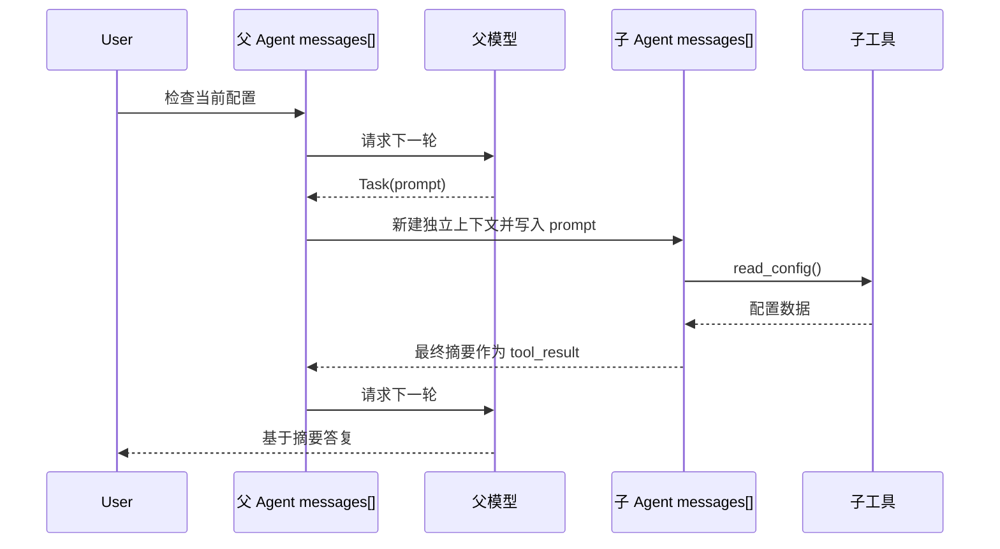
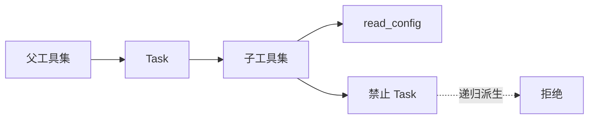

# Step 10 · Subagent：把调查装进独立上下文

[Guide](../README.md) · [Step 09](../step-09-session/) → **Step 10** → [Step 11](../step-11-agent-team/)

> **口号**：父循环拿结论，子循环扛细节。
>
> **Harness 层**：任务委派——用独立 `messages[]` 完成一段调查，只把摘要交还主上下文。

---

## 问题

主 Agent 的上下文是稀缺资源。让它亲自读十几个文件、翻一堆日志、再对比几条实现， `messages[]` 会被大量中间工具结果填满。等真正要写代码时，留给目标、约束和近期决策的空间已经不多。

直接把另一个 Agent 的全部 transcript 合并回来并不能解决问题，只是把噪音换了个位置。父循环需要的往往不是“子 Agent 看过什么”，而是“结论是什么、证据够不够、下一步建议什么”。

---

## 解决方案

把“调查任务”做成一个普通工具：

```python
PARENT_TOOL_HANDLERS = {
    "Task": run_task,
}
```

父循环收到 `Task` 调用后，创建一个全新的子 `messages[]`：

```text
父 messages[]                  子 messages[]
user: 检查配置               user: 检查配置
assistant: Task(...)           assistant: read_config(...)
                               user: tool_result(...)
                               assistant: 最终摘要
user: tool_result(最终摘要)
assistant: 答复用户
```

子 Agent 只拿到本章允许的工具，例如 `read_config`。它没有 `Task` 工具，因此不能继续派生孙子 Agent。`run_task()` 返回给父循环的字符串，就是最终摘要；这份摘要作为 `tool_result` 进入父上下文，子的完整过程不进入父上下文。

完整代码在 [agent.py](./agent.py)。为了离线可运行，父模型和子模型都是剧本模型；真实项目只需把 `create()` 换成 Messages API 调用，消息循环保持不变。

---

## 图示



另一个关键边界是递归：



图里两个 `messages[]` 没有共享边。父上下文只接收摘要，不接收子的 assistant blocks 和工具结果。

---

## 工作原理

### 1. 父循环仍然只认识工具

父模型不需要知道子 Agent 的类名或实现。它只返回一个结构化工具调用：

```python
{
    "type": "tool_use",
    "id": "parent_task_01",
    "name": "Task",
    "input": {"prompt": "检查当前配置，并给出可用结论"},
}
```

宿主执行 `Task` 时才创建子 Agent。这使子 Agent、文件读取、搜索、计算都可以被同一套工具循环统一调度。

### 2. 子 Agent 有独立生命周期

`Subagent.run()` 接收一个新列表：

```python
self.messages = [{"role": "user", "content": prompt}]
```

它内部一样遵守工具协议：assistant 请求工具，宿主执行，`tool_result` 回填，直到 assistant 给出最终文本。这个循环和 Step 05 的形状相同，差别只在工具集更小、生命周期更短。

### 3. 返回值是摘要，不是 transcript

`run_task()` 返回：

```python
return subagent.run()
```

父循环随后把它包装成：

```python
{"type": "tool_result", "tool_use_id": call["id"], "content": summary}
```

因此父上下文看到的是一个紧凑结果。子上下文可以保留长输出、失败尝试和无关线索，结束时不污染主会话。

### 4. 禁止递归靠工具集，不靠 prompt

Prompt 里写“请不要再创建子 Agent”只是建议。这里用更硬的边界：

```python
SUBAGENT_TOOL_HANDLERS = {"read_config": read_config}

if tool_name == "Task":
    raise RuntimeError("Task cannot spawn another Task")
```

子 Agent 的 schema 里没有 `Task`，执行器中也有防御性检查。这样即使剧本或模型出错，也不会产生不受控的递归树。

---

## 试一下

项目根目录执行：

```bash
py -3.13 guide/step-10-subagent/agent.py
```

预期输出：

```text
parent: Task(prompt='检查当前配置，并给出可用结论')
subagent: read_config()
parent tool_result: 配置检查完成：模式为 offline，默认模型为 bc-mini。
parent final: 配置检查完成：模式为 offline，默认模型为 bc-mini。
contexts: parent=4 child=4
```

运行验收：

```bash
py -3.13 guide/step-10-subagent/agent.py --check
```

自检会验证：

1. 父子上下文是两个不同列表
2. 子上下文从任务 prompt 开始，完整保留自己的工具轮次
3. 最终摘要原样成为父循环 `tool_result`
4. 子工具集中没有 `Task`
5. 尝试在子循环调用 `Task` 会被拒绝

---

## 常见坑

| 现象 | 原因 | 处理 |
|---|---|---|
| 父上下文仍然爆炸 | 把子 transcript 合并回主循环 | 只返回最终摘要 |
| 子 Agent 派生子 Agent | 两层使用同一个工具集 | 子工具集显式移除 `Task` |
| 父拿到结论却无法行动 | 摘要只写“完成了” | 摘要包含事实、结论和建议下一步 |
| 子任务失败没有结果 | 抛异常打断父循环 | 包装成错误 `tool_result` 交回父模型 |
| 子 Agent 停不下来 | 没有轮次上限 | 教学版 `max_turns` 强制终止 |
| 权限随意外扩 | 子 Agent 继承全部能力 | 按任务授予最小工具集 |

---

## 接下来

一次性子 Agent 适合独立调查，但每次调用都会新建上下文。如果任务需要同一个角色持续接收消息、记住约定并多次汇报，就需要持久队友。

[Step 11](../step-11-agent-team/) → 用一个 Team、`Spawn`、inbox 和消息唤醒实现多角色协作。
