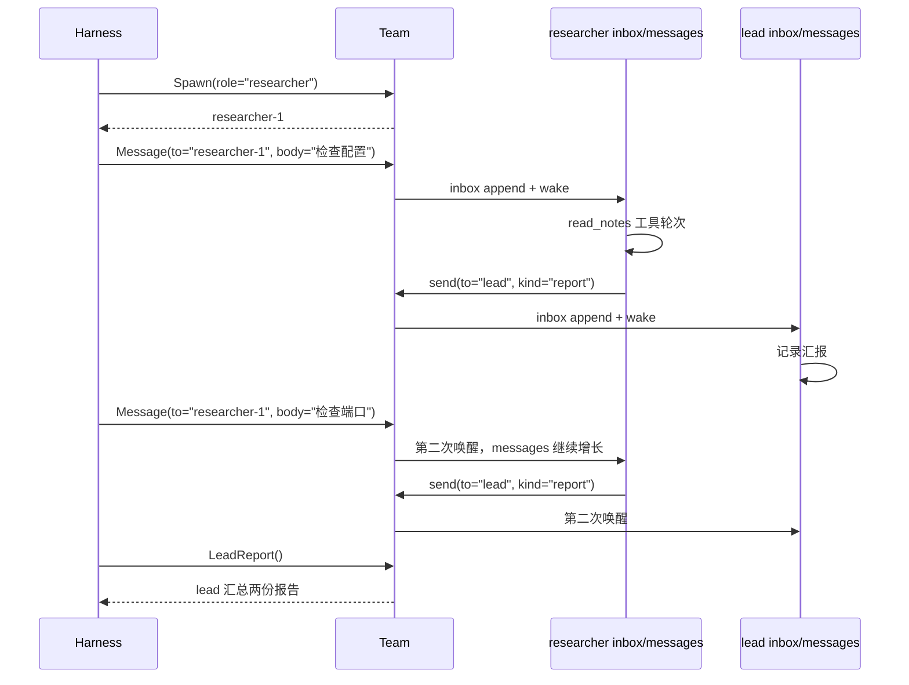
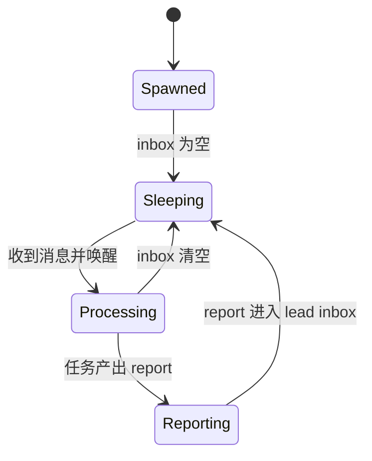

# Step 11 · Agent Team：持久队友与 inbox

[Guide](../README.md) · [Step 10](../step-10-subagent/) → **Step 11** → [Step 12](../step-12-mcp/)

> **口号**：队友不退出，消息来唤醒。
>
> **Harness 层**：多角色协作——一个 Team、持久成员、收件箱和 lead 汇总。

---

## 问题

Step 10 的子 Agent 是一次性的：任务来了，创建上下文，执行，返回摘要，然后消失。这很适合独立调查，但不适合这样的工作：

```text
Researcher 先查配置，再根据上一轮结果查端口约定
Reviewer 需要记住项目约定，多次评审同一批代码
Lead 需要收齐多个成员的汇报，再向主循环交结论
```

如果每次都新建 Agent，成员无法自然保留共同约定，也难以判断“这是同一个人接着做”。反过来，如果所有成员都常驻线程并不断轮询，又会浪费调度和上下文。

---

## 解决方案

本章实现一个最小团队运行时：

| 能力 | 做法 |
|---|---|
| 单队 | 只有一个 `Team` 对象，固定包含 `lead` |
| Spawn | `Team.spawn(role, brief)` 添加持久成员 |
| inbox | 每个成员有独立收件箱，消息先入队 |
| 消息唤醒 | `send()` 投递后立即唤醒接收者处理 inbox |
| lead 汇报 | 成员把 report 发给 lead，lead 汇总成对外结果 |

核心数据结构：

```python
team.members = {
    "lead": Teammate(...),
    "researcher-1": Teammate(...),
}

teammate.inbox = [
    InboxMessage(id="msg-1", sender="lead", kind="task", body="检查配置"),
]
teammate.messages = [...]  # 只属于这个成员，跨多次唤醒保留
```

教学版只有一个 Researcher 成员。它被唤醒两次，处理两个任务；第二次唤醒时，之前的 `messages[]` 仍在，所以它知道自己是同一个 researcher，而不是新子 Agent。

---

## 图示



成员状态的生命周期：



---

## 工作原理

### 1. Team 是唯一边界

所有成员都在 `Team.members` 里，id 由团队统一生成：

```python
member_id = f"{role}-{sequence}"
```

`lead` 在构造函数中创建，后续 `spawn()` 添加其他角色。主循环不需要维护多个散落的 Agent 对象，只需向这个 Team 发工具调用。

### 2. inbox 解耦“发送”和“处理”

`send()` 做两件事：

```python
recipient.inbox.append(message)
recipient.wake()
```

消息先成为可审计的事件，再触发处理。生产系统可以把 wake 换成事件循环、任务队列或异步调度；本章选择同步唤醒，是为了让默认演示完全离线且顺序可预测。

### 3. messages 是持久记忆

每次唤醒处理 inbox 时，新消息和工具轮次继续追加到同一个成员的 `messages[]`。因此 Researcher 第二次汇报时，上一轮的报告仍在自己的上下文里。

这就是持久队友和 Step 10 一次性子 Agent 的核心区别：

```text
Subagent: prompt -> new messages -> summary -> 结束
Teammate: message -> 唤醒已有 messages -> report -> 睡眠
```

### 4. lead 是汇聚点，不是全知控制者

Researcher 自己执行 `read_notes` 并生成 report；lead 只接收 report、记录证据并汇总。这个边界避免了 lead 反复转发细节，把每个角色的上下文保持在各自任务附近。

### 5. 工具层仍然统一

主循环看到的是三个工具：

```python
handlers = {
    "Spawn": ...,
    "Message": ...,
    "LeadReport": ...,
}
```

团队内部可以继续扩展 `Write`、`Read`、`Review` 等工具，但成员间协作统一走 inbox 消息，而不是直接改别人的 `messages[]`。

---

## 试一下

项目根目录执行：

```bash
py -3.13 guide/step-11-agent-team/agent.py
```

预期输出：

```text
Spawn -> researcher-1
Message -> researcher-1 handled: 检查配置 (msg-1)
Message -> researcher-1 handled: 检查端口 (msg-3)
LeadReport -> lead received 2 reports
wake order -> researcher-1:msg-1, lead:msg-2, researcher-1:msg-3, lead:msg-4
```

运行验收：

```bash
py -3.13 guide/step-11-agent-team/agent.py --check
```

自检会验证：

1. 只有一个 Team，且只有一个 `researcher-1`
2. 两次任务唤醒的是同一个成员对象
3. researcher 的 `messages[]` 连续保留两次工具轮次
4. lead 收到两份 report 并生成汇总
5. 所有 inbox 最终为空
6. 发给不存在成员会被拒绝

---

## 常见坑

| 现象 | 原因 | 处理 |
|---|---|---|
| 成员丢上下文 | 每次消息都重建 Agent | 按成员 id 复用对象 |
| 消息静默丢失 | 只打印不落 inbox | inbox 是唯一入队事实 |
| 成员互相污染 | 直接写对方 messages | 通过消息接口通信 |
| lead 变成瓶颈 | 所有细节都汇报给 lead | report 只包含结论和证据索引 |
| 唤醒风暴 | report 又触发无限循环 | 队内消息带类型和终止条件 |
| 团队状态散落 | 多个全局 Agent 对象 | 单一 Team 管成员和 id |

---

## 接下来

团队和内置工具都在同一个进程里。如果工具来自外部服务器，宿主需要在启动后动态发现工具，并把它们并入统一命名空间。

[Step 12](../step-12-mcp/) → 用 fake MCP registry 演示动态发现和 `mcp__server__tool` 命名。
