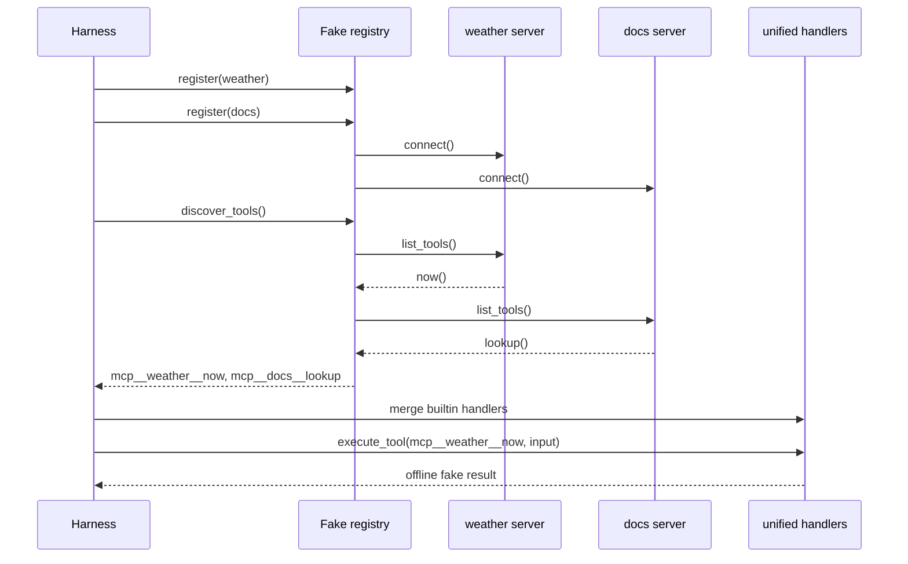
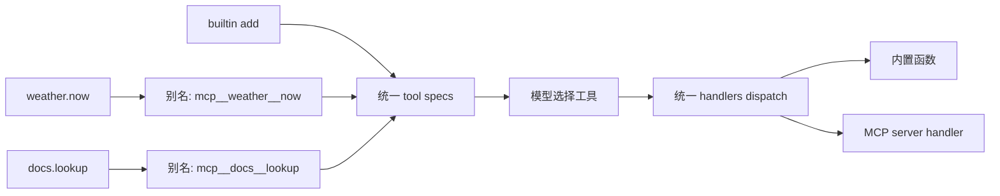

# Step 12 · MCP：动态发现并统一调度外部工具

[Guide](../README.md) · [Step 11](../step-11-agent-team/) → **Step 12** → [Step 13](../step-13-hooks/)

> **口号**：工具来自服务器，调度仍归宿主。
>
> **Harness 层**：MCP 集成——发现外部工具、生成全局名、并入统一 handlers。

---

## 问题

前面的工具都写在 Python 文件里，启动时就知道名字。真实 Agent 常常还要接入外部能力：

```text
weather 服务器提供 now / forecast
docs 服务器提供 search / get
公司内部 registry 服务器提供自己的业务工具
```

这些工具可能随服务器版本变化，也可能在启动后才连接。如果把 `weather.now`、`docs_search`、内置 `add` 全部硬编码进主循环，每接一个服务器就要改一次循环，名字冲突也没有规则可查。

---

## 解决方案

本章用一个 fake MCP registry 模拟三个阶段：

1. 服务器注册并连接
2. 宿主调用 `list_tools()` 动态发现工具
3. 工具改名为 `mcp__server__tool`，和内置工具并入同一个 `handlers`

最终调度界面仍然只有一个：

```python
hub.execute_tool("add", {"a": 2, "b": 5})
hub.execute_tool("mcp__weather__now", {"city": "shanghai"})
hub.execute_tool("mcp__docs__lookup", {"topic": "tool-loop"})
```

模型看到的不是三套调用协议，而是同一个工具列表；宿主执行的也不是三套 if/else，而是同一个统一 handler 注册表。

完整代码在 [agent.py](./agent.py)。Fake server 不监听端口、不发网络请求，只保留 MCP 集成最核心的形状：server name、tool schema、handler、动态发现和命名冲突检查。

---

## 图示



命名和调度边界：



---

## 工作原理

### 1. Registry 是发现边界

`FakeMcpServer` 保存服务器名和工具列表，`list_tools()` 返回工具定义。生产实现里这一步对应 MCP client 与 server 的握手、能力协商和工具列举；教学版把它们压缩成一个离线方法调用。

服务器名和本地工具名都只允许安全字符，并禁止包含双下划线。这层校验发生在注册和发现时，而不是等模型调用失败后再排查。

### 2. 全局名有固定规则

发现每个工具时生成：

```text
mcp__<server_name>__<tool_name>
```

例如：

| Server | Local tool | Global tool |
|---|---|---|
| `weather` | `now` | `mcp__weather__now` |
| `docs` | `lookup` | `mcp__docs__lookup` |

前缀 `mcp__` 让内置工具和外部工具一眼可分；中间的 server name 提供命名空间，避免两个服务器都叫 `search` 时互相覆盖。

### 3. Schema 和 handler 一起被发现

每个 MCP 工具包含：

```python
McpTool(
    name="now",
    description="Return deterministic fake weather.",
    input_schema={...},
    handler=weather_now,
)
```

`ToolHub.connect()` 发现工具后做两件事：把别名和 schema 合并进模型可见工具列表，把别名和 handler 合并进统一调度表。这样模型选择工具和宿主执行工具使用的是同一个名字。

### 4. 冲突必须早失败

以下情况直接抛错：

```text
重复注册同名 server
两个 server/tool 组合生成同名全局工具
动态工具名撞上内置工具名
```

工具名是调度协议的一部分。宁可启动时失败，也不要静默覆盖后在运行时调用到错误实现。

### 5. 主循环不需要知道 MCP

对 Step 05 的工具循环来说，MCP 工具和内置工具没有区别：

```python
response = model.create(messages, tools=hub.tool_specs())
...
output = hub.execute_tool(call.name, call.input)
```

这就是“动态发现，统一调度”的意义：扩展来自外部，协议仍然收敛在宿主。

---

## 试一下

项目根目录执行：

```bash
py -3.13 guide/step-12-mcp/agent.py
```

预期输出：

```text
tools: add, mcp__weather__now, mcp__docs__lookup
add(2, 5) -> 7
mcp__weather__now(shanghai) -> shanghai: 26C (offline fake)
mcp__docs__lookup(tool-loop) -> tool-loop: model requests, host executes
```

运行验收：

```bash
py -3.13 guide/step-12-mcp/agent.py --check
```

自检会验证：

1. 动态工具名全部符合 `mcp__server__tool`
2. 内置 `add` 和两个 MCP 工具出现在同一张工具列表
3. 统一 handlers 能执行内置和外部工具
4. 重复注册服务器会被拒绝
5. 全局名冲突会被拒绝
6. 含双下划线的本地工具名会被拒绝

---

## 常见坑

| 现象 | 原因 | 处理 |
|---|---|---|
| 两个 `search` 互相覆盖 | 直接使用本地工具名 | 加 `mcp__server__` 命名空间 |
| 模型选中的名字无法执行 | schema 和 handlers 来源不一致 | 两者都从同一次发现结果生成 |
| 服务器断开后仍出现在工具列表 | 只在启动时发现一次 | 服务器状态变化后重新同步并重建列表 |
| 工具异常打崩主循环 | MCP 错误没有包装 | 捕获后作为错误 `tool_result` 返回 |
| 权限边界失控 | 所有 MCP 工具默认放行 | 外部工具同样进入 Permission 决策 |
| schema 没校验 | server 返回任意 JSON | 至少校验类型、必填参数和名字 |

---

## 接下来

现在工具可以来自内置函数，也可以来自 MCP 服务器。下一章回到宿主生命周期：在不修改主循环的情况下增加观察、截断和拦截策略。

[Step 13](../step-13-hooks/) → 用 PreToolUse、PostToolUse 和 Stop hooks 扩展 Agent。
