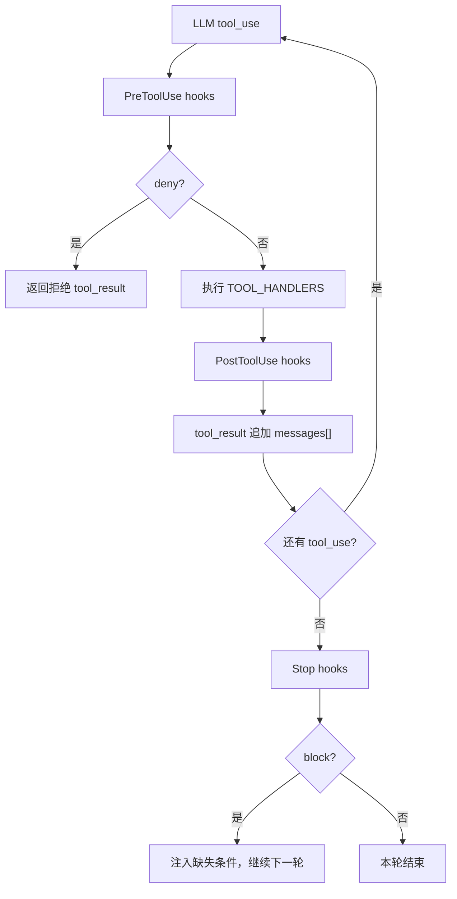
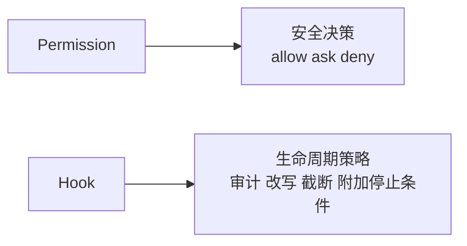

# Step 13 · Hooks：扩展点不改主循环

[Guide](../README.md) · [Step 12](../step-12-mcp/) → Step 13 → [Step 14](../step-14-permission/)

> **口号**：挂在循环上，不写进循环里。
>
> **Harness 层**：生命周期扩展——观察、改写、拦截工具与轮次事件。

---

## 问题

Agent 主循环稳定后，需求会不断冒出来：

```text
Write 的路径统一成正斜杠
工具输出太长，先截断再进 messages
模型想停止时检查一下有没有验证证据
```

如果每加一个策略就改一遍工具循环，`run_tool` 很快会变成一团 if/else。Hooks 把这些策略抽到事件上：主循环只保留固定生命周期点，具体策略注册进来。

---

## 解决方案

教学版定义三个事件：

| 事件 | 时机 | 本例用途 |
|---|---|---|
| `PreToolUse` | 执行工具前 | 改写参数或拒绝调用 |
| `PostToolUse` | 执行工具后 | 截断/审计输出 |
| `Stop` | 模型准备结束本轮 | 根据证据放行或阻止 |

主循环形状不变：

```python
blocked = emit("PreToolUse")
if blocked: return denied
output = execute_tool()
emit("PostToolUse")
```

---

## 图示



Hook 与 Permission 的分工：



---

## 工作原理

### 1. Hook 是事件 + matcher + handler

```python
registry.on("PreToolUse", normalize_path, matcher="Write")
```

matcher 决定这条 hook 只对哪些工具生效；handler 收到上下文，可以改写 `ctx["input"]`，也可以返回结构化决策。

### 2. deny / block 短路，allow 不短路

普通 hook 返回 `None` 或 `allow` 时继续后续 hook；返回 `deny` 或 `block` 时立即停止。这样才能串多个观察型 hook，同时保留硬拦截。

### 3. PostToolUse 只改观察结果

教学示例把超长输出截断后再放入 `tool_result`。这样上下文不会被几千行日志淹没。

### 4. Stop hook 是扩展停止条件的入口

本例要求 transcript 里出现 `tool_result ok` 才允许停止。Step 16 的 Goal Loop 会把这个思想升级为独立评估器。

---

## 试一下

```bash
py -3.13 guide/step-13-hooks/agent.py
py -3.13 guide/step-13-hooks/agent.py --check
```

观察点：

1. Windows 路径被 PreToolUse 改成 `/`
2. `/etc/hosts` 被 deny
3. 长输出被 PostToolUse 截断
4. 无证据停止被 Stop hook block，有证据则放行

完整实现见 `src/bc_code_agent/hooks.py` 和 `hooks.json`：支持内置 handler、外部命令、事件别名、JSON 协议和超时。

---

## 常见坑

| 坑 | 后果 | 处理 |
|---|---|---|
| 每个策略都改主循环 | 循环难以维护 | 策略注册到生命周期事件 |
| hook 异常直接打崩 Agent | 一个插件影响全局 | 完整实现捕获并报告 hook 异常 |
| 所有 hook 都短路 | 后续审计/截断被跳过 | 只有 deny/block 短路 |
| hook 变成第二套权限系统 | 职责混乱 | 安全准入交给 Permission，hook 做策略 |
| Stop hook 无限 block | 循环停不下来 | 配合重试/上限，必要时交还用户 |

---

## 接下来

Hooks 解决“怎么扩展”，但安全准入还需要一个明确的一等管道。Step 14 实现 `allow / ask / deny` 权限决策。
