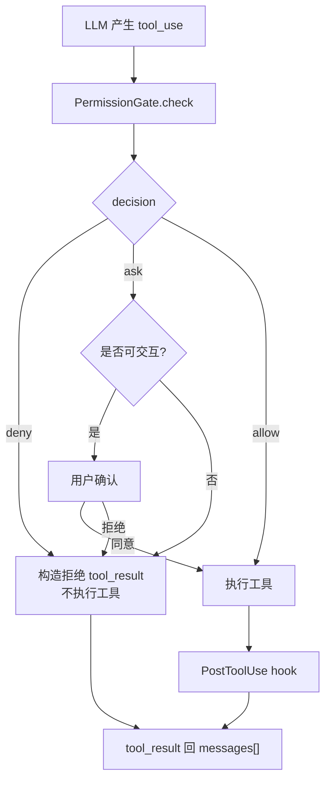
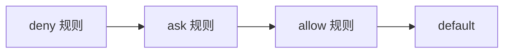

# Step 14 · Permission：先划边界，再给自由

[Guide](../README.md) · [Step 13](../step-13-hooks/) → Step 14 → [Step 15](../step-15-background/)

> **口号**：先划边界，再给自由。
>
> **Harness 层**：安全边界——所有工具执行前的统一闸门。

---

## 问题

Step 05 之后，模型可以调用工具了；Step 10 之后，子 Agent 和队友也会走同一条工具链。只要能力变强，一个问题立刻出现：

```text
模型想执行 rm -rf /
模型想写 .env
模型想 git push
```

这些请求不应该直接进入 `TOOL_HANDLERS`。工具循环只回答“怎么执行”，权限管道先回答“要不要执行”。

权限不是 prompt 里的一句“请不要做危险操作”。模型可以遵守规则，也可以忘记规则；Harness 必须在代码层保证边界不可绕过。

---

## 解决方案

每个工具调用在执行前先经过同一道闸门：

```text
tool_use(name, input)
  ↓
PermissionGate.check()
  ↓
deny  → 返回拒绝的 tool_result，不执行
ask   → 用户确认；非交互环境默认拒绝
allow → 进入 TOOL_HANDLERS
```

教学版实现三件事：

1. 规则匹配：`Read|Grep`、`Shell(*)`、`Write(path=.env*)`
2. 档位优先：`deny > ask > allow > default`
3. fail-closed：无人交互时，`ask` 不能自动变成同意

---

## 图示



档位优先是本章最重要的细节：



即使配置里把 `Shell(*) = allow` 写在最前面，`Shell(rm -rf*) = deny` 仍然必须赢。

---

## 工作原理

### 1. 决策是值，不是字符串描述

```python
DECISIONS = ("deny", "ask", "allow")

@dataclass(frozen=True)
class Verdict:
    decision: str
    rule: str
    reason: str
```

`Verdict` 记录三件事：结果、命中的规则、给人看的理由。工具执行器只认 `decision`，不解析自然语言。

### 2. 档位优先，规则顺序不决定安全

```python
for decision in DECISIONS:          # deny -> ask -> allow
    for rule in self.rules:
        if rule["decision"] != decision:
            continue
        if self._matches(rule["match"], tool_name, tool_input):
            return Verdict(...)
```

这不是“谁先出现谁生效”的规则引擎，而是安全档位优先。`deny` 全部检查完才轮到 `ask`，`ask` 全部检查完才轮到 `allow`。

### 3. 参数规则让策略更精确

```text
Shell(*)              所有 Shell
Shell(git push*)      command 以 git push 开头的 Shell
Write(path=.env*)     path 以 .env 开头的 Write
```

教学版用 `fnmatch` 匹配 glob。真实项目里的 `permissions.py` 还支持多个备选和参数组合，但核心思想不变：**工具名 + 参数模式**共同决定风险。

### 4. `ask` 在非交互环境必须拒绝

```python
if verdict.decision == "ask":
    if not interactive:
        return "DENIED: non-interactive ask is fail-closed"
```

无人值守的 Cron、后台任务、异步队友都不能抢主终端弹出确认。它们收到 `ask` 时应得到拒绝结果，然后让模型换安全路径。

---

## 试一下

```bash
py -3.13 guide/step-14-permission/agent.py
py -3.13 guide/step-14-permission/agent.py --check
```

观察点：

1. `Read` 命中 allow
2. `pytest -q` 命中 `Shell(*)` allow
3. `git push` 命中 ask
4. `rm -rf /` 和写 `.env` 命中 deny
5. 未命中的 `Task` 落到 default=ask
6. 非交互的 `git push` 被拒绝，而不是静默放行

完整实现见 `src/bc_code_agent/permissions.py`。它还包含 JSON 配置加载、损坏配置 fail-closed、YOLO 模式只放行 ask、MCP 通配等边界。

---

## 常见坑

| 坑 | 后果 | 处理 |
|---|---|---|
| 把权限写进 system prompt | 模型可能忘记或绕过 | 权限必须在工具执行前的代码层生效 |
| 规则顺序优先 | 后写的 deny 可能被先写的 allow 覆盖 | 使用 deny > ask > allow 档位优先 |
| 非交互 ask 默认 allow | 无人值守时危险操作爆发 | ask 必须默认拒绝 |
| 只按工具名判断 | 所有 Shell 只能一起 allow/deny | 支持参数 glob |
| 配置损坏时回退宽松默认 | 安全边界消失 | 已存在的配置损坏应启动失败或回退严格默认 |

---

## 接下来

权限解决“能不能做”，但没有解决“慢命令堵住主循环”。Step 15 会把长耗时 Shell 放到后台，先返回占位结果，完成后再把通知注入下一轮 `messages[]`。
