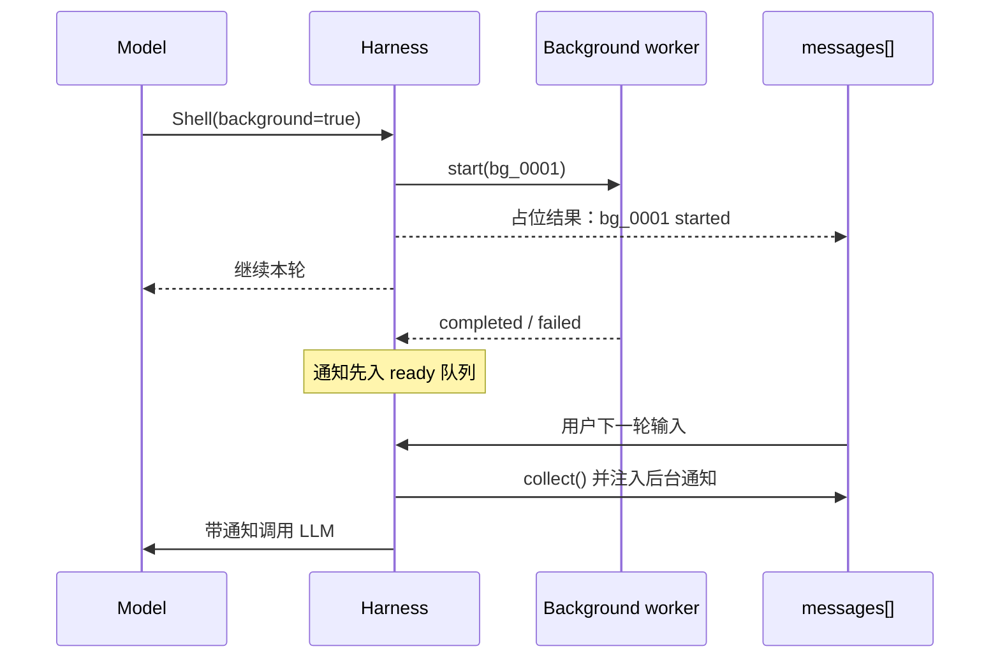

# Step 15 · Background：慢命令别堵思考

[Guide](../README.md) · [Step 14](../step-14-permission/) → Step 15 → [Step 16](../step-16-goal-loop/)

> **口号**：慢命令别堵思考。
>
> **Harness 层**：异步执行——让主循环立即继续，完成结果稍后注入。

---

## 问题

Agent 让模型执行 `pip install`、完整测试套件、构建脚本时，经常要等几十秒甚至几分钟。如果工具执行是同步的，整个循环都会卡在这里：

```text
tool_use(Shell pytest)
  ↓
主循环阻塞，终端无响应
  ↓
模型什么都做不了
  ↓
测试结束，才拿到 tool_result
```

对不阻塞后续推理的命令，更好的行为是：立即返回任务 id，后台执行，完成后再把结果作为通知注入下一轮模型调用。

---

## 解决方案

```text
Shell(background=true)
  ↓
登记 bg_0001，daemon 线程执行
  ↓
立刻返回占位 tool_result
  ↓
主循环继续处理其它事
  ↓
任务完成 → collect() 取通知
  ↓
下一轮 LLM 前注入 messages[]
```

教学版用线程执行安全函数，避免真的跑系统命令；完整实现用独立进程组跑 Shell，并负责 kill、超时和进程树清理。

---

## 图示



关键语义是**完成不唤醒**：普通对话模式下，后台完成只进入队列，等下一次有理由调用模型时一起注入，避免和用户抢终端。

---

## 工作原理

### 1. 立即返回占位结果

```python
task_id = manager.start("pytest -q", slow_job)
placeholder = manager.placeholder(task_id)
```

模型收到的不是测试输出，而是“任务已启动”。它可以把 id 告诉用户，也可以继续做不依赖测试结果的工作。

### 2. 完成通知是队列，不是直接打印

```python
notifications = manager.collect()
```

`collect()` 做两件事：

1. 取出所有已完成任务的格式化通知
2. 清空 ready 队列，保证同一条通知不会重复注入

### 3. 通知并入最后一条 user 消息

```python
inject_background(messages, notifications)
```

如果最后一条 user content 是字符串，就直接附加；否则新开一条 user 消息。这样模型在下一次请求里能看到通知，同时不破坏 tool_use / tool_result 的配对结构。

### 4. 依赖结果的步骤仍然要同步

后台不是万能加速。下一步要读测试输出才能修 bug 时，必须同步等待；只有安装依赖、长测试、构建这类独立任务适合后台。

---

## 试一下

```bash
py -3.13 guide/step-15-background/agent.py
py -3.13 guide/step-15-background/agent.py --check
```

观察点：

1. 占位结果先出现，`main loop is free to continue...` 不等待后台函数
2. 任务完成后通知只被 collect 一次
3. 下一轮 `messages[-1]` 里包含 `bg_0001 completed`

完整实现见 `src/bc_code_agent/bg_jobs.py`：真实 subprocess、超时、Windows/POSIX 进程组、kill、`/bg` 管理命令。

---

## 常见坑

| 坑 | 后果 | 处理 |
|---|---|---|
| 后台完成立刻抢终端 | 打断用户输入 | 普通对话用完成不唤醒 |
| 通知不消费 | 下轮重复看到旧结果 | collect 后清空队列 |
| 后台任务修改 `tool_result` 原文 | 破坏 tool_use_id 配对 | 完成通知独立注入 |
| 所有命令都后台 | 后续步骤拿不到依赖结果 | 只有独立慢命令显式 background=true |
| 只杀父进程 | 子进程变孤儿 | 完整实现按进程组/进程树清理 |

---

## 接下来

现在工具执行能快慢分离，但 Agent 仍可能提前说“完成了”。Step 16 引入 Goal Loop：目标必须可验证，由独立评估器决定循环能不能停。
