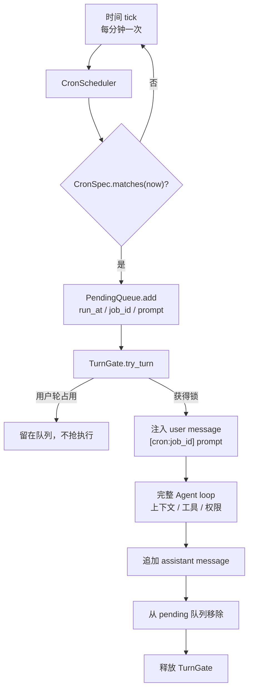
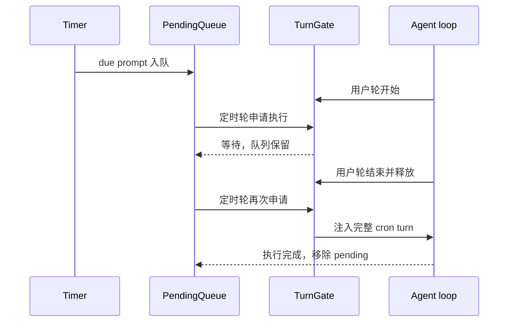

# Step 19 · Cron：到点自己开工

[Guide](../README.md) · [Step 16](../step-16-goal-loop/) → **Step 19** → [Step 20](../step-20-workflow/)

> **口号**：到点自己开工。
>
> **Harness 层**：时间边界——把“现在该做什么”变成一条可执行的 Agent 轮次。

---

## 问题

到 Step 16 为止，Agent 仍然是被动的：用户输入，它思考；用户不输入，它就永远安静。可真实工作里有一类任务不是由人触发的：

```text
每天 09:30：查看昨天的 TODO，生成今日计划
每周五 17:00：运行测试，如果失败就开始修复
每 15 分钟：检查后台任务并汇报异常
```

最省事的做法是在定时器回调里直接执行函数。但对 Agent 来说，这不够：定时任务不是一条日志，也不是一次普通函数调用。它要进入同一个 `messages[]`，带上上下文、工具、权限和会话状态，像用户发起一轮对话一样完整执行。

同时还有一个并发问题：定时任务到点时，用户可能正在输入，Agent 可能正在跑工具循环。两者不能同时改同一份历史，也不能同时抢同一个终端。

---

## 解决方案

教学版把 Cron 拆成三段：

```text
CronSpec       解析并匹配五字段表达式
Scheduler      每分钟扫描，把到期任务放进 pending 队列
ScheduledAgent 拿到锁后，把 prompt 注入完整 user + assistant turn
```

核心语义是：

1. 表达式只回答“这个分钟是否命中”
2. 命中后先进 pending 队列，不直接执行
3. 只有拿到 `TurnGate`，定时 prompt 才能进入主循环
4. 用户轮和定时轮共用同一把锁，同一时刻只允许一个完整 turn

完整代码在 [agent.py](./agent.py)。教学版用离线函数生成 assistant 回复；把 `_append_turn()` 换成真实工具循环后，形状不变。

---

## 图示



用户轮和定时轮的关系如下：



最重要的一条线不是“时间到”，而是“拿到 turn gate 之后才开始”。

---

## 工作原理

### 1. 五字段表达式先校验再使用

```python
fields = expression.split()
if len(fields) != 5:
    raise ValueError("cron expression must have exactly 5 fields")
```

五个字段依次是：

```text
minute  0-59
hour    0-23
dom     1-31
month   1-12
dow     0-6，0 表示周日
```

每个字段支持 `*`、数字、范围、逗号列表和步长：

```text
*/15 9-17 * * 1-5
```

表示工作日 09:00 到 17:59，每 15 分钟一次。校验失败时直接抛 `ValueError`，不能等到运行时才发现写错。

### 2. 星期需要转换坐标系

```python
cron_weekday = (at.weekday() + 1) % 7
```

Python 的 `weekday()` 周一是 `0`；cron 惯例周日是 `0`。这一行做转换。实现 cron 时最常见的隐藏 bug 就是把两套编号混在一起。

### 3. 日和星期是 OR

```python
if self.days_of_month is None and self.days_of_week is None:
    return True
```

如果日和星期都被限制，cron 的历史约定是任一命中即可，例如 `0 0 1 * 1` 表示每月 1 号或每个周一。教学版保留这个约定，并在自检里覆盖。

### 4. pending 队列隔离“到点”和“可执行”

```python
queue.add(PendingTurn(minute, job.id, job.prompt))
```

定时器线程只负责把到期任务放进队列。它不知道用户在不在输入，也不知道工具循环是否忙。执行线程稍后从队列取出任务，避免时间线程直接修改 `messages[]`。

### 5. 同一分钟不能重复入队

```python
key = (job.id, minute)
if job.spec.matches(minute) and key not in self.fired_keys:
    ...
```

定时器可能抖动，同一分钟被扫描两次。没有去重的话，一次 09:15 会执行两次。

### 6. 定时轮必须注入完整 turn

```python
turn = [
    {"role": "user", "content": f"[cron:{item.job_id}] {item.prompt}"},
    {"role": "assistant", "content": complete(...)},
]
```

定时任务进入历史时要有来源标记。这样后续上下文、审计和 UI 都知道这不是用户亲手输入的内容。真实实现里 assistant 生成过程会调用完整 Agent loop，而不是拼一句话。

### 7. 用户轮和定时轮共用一把锁

```python
with self.gate.try_turn() as acquired:
    if not acquired:
        return None
```

锁保护的是整个 turn：从追加 user message，到工具循环，再到追加 assistant message。只在发送 API 请求时加锁是不够的，因为工具结果还会继续追加历史。

---

## 试一下

在项目根目录执行：

```bash
py -3.13 guide/step-19-cron/agent.py
```

预期输出：

```text
expression: */15 9-17 * * 1-5
09:14 match: False
pending after 09:14 tick: 0
09:15 match: True
pending after 09:15 tick: 1
scheduled turns executed: 1
pending after duplicate tick: 0
scheduled waits while user turn owns gate: True
queued turn executed after gate release: True
transcript messages: 6
```

观察点：

1. 09:14 不命中，09:15 命中
2. 同一分钟第二次 tick 不会重复入队
3. 用户轮持有 `TurnGate` 时，定时轮留在 pending 队列
4. 锁释放后，定时轮注入完整 `user + assistant` turn

运行验收：

```bash
py -3.13 guide/step-19-cron/agent.py --check
```

自检覆盖非法表达式、范围和步长校验、星期换算、日/星期 OR 语义、pending 到期、重复 tick 去重、完整 turn 注入，以及用户轮和定时轮互斥。

---

## 常见坑

| 坑 | 后果 | 处理 |
|---|---|---|
| 到点直接执行函数 | 绕过上下文、工具和权限 | 先变成 prompt，再进完整 Agent loop |
| 定时器和主循环同时改 `messages[]` | 历史交错或丢失 | 整个 turn 由同一把锁保护 |
| 同一分钟重复扫描 | 任务执行两次 | `(job_id, minute)` 去重 |
| 星期编号混用 | 周日/周一错位 | 明确 cron 周日为 0 |
| 定时轮直接弹确认框 | 无人值守任务卡死 | 非交互 ask 默认拒绝 |
| 队列不落盘 | 进程重启后丢任务 | 生产版 pending 也要持久化 |

---

## 接下来

Cron 解决“什么时候开始”，但有些工作路径是固定的：先取上下文，再交给 Agent 判断，最后执行命令并留审计。[Step 20](../step-20-workflow/) 会把这些路径写成 workflow registry，并加上 `run_if` 条件和 JSONL journal。
