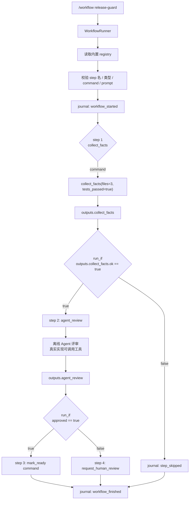
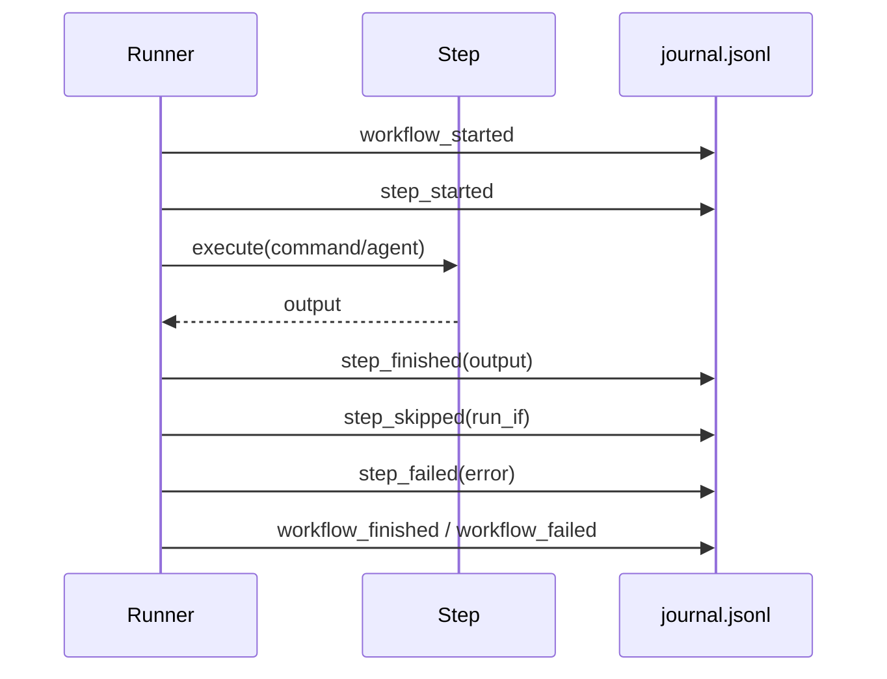

# Step 20 · Workflow：固定路径写进编排

[Guide](../README.md) · [Step 19](../step-19-cron/) → **Step 20**

> **口号**：固定路径写进编排。
>
> **Harness 层**：流程边界——人负责定义路径，Agent 负责路径中需要判断的环节。

---

## 问题

Cron 能让工作到点开始，但有些任务不仅要知道“何时开始”，还要保证“按什么顺序做”：

```text
发布前检查：
1. 收集变更事实
2. 让 Agent 评审
3. 评审通过后执行 ready 标记
4. 评审失败则转人工
```

如果每次都靠用户重新写一段 prompt，路径会漂移：今天先看测试，明天忘了看；今天要求审计，明天没留记录。Agent 的判断能力很重要，但产品里还有一类确定性流程，应该由 Harness 固定下来。

---

## 解决方案

这一章做一个最小 workflow 引擎，包含四件事：

1. **内置 registry**：用 Python 字典描述 workflow，形状与 YAML 一致
2. **command step**：执行宿主注册过的确定性命令
3. **agent step**：把 prompt 和已有输出交给 Agent 判断
4. **journal**：每个步骤的开始、完成、跳过、失败都追加到 JSONL

教学版不强制 PyYAML，也不调用 API：

```text
WORKFLOW_REGISTRY
  ↓
run_if 是否满足?
  ├── 否：记录 step_skipped，不执行
  └── 是：
        command → COMMAND_REGISTRY 中的函数
        agent   → 离线评审函数（真实实现为子 Agent loop）
  ↓
journal.jsonl 追加审计事件
```

完整代码在 [agent.py](./agent.py)。演示文件放在 `tempfile.TemporaryDirectory()`，进程结束后自动清理。

---

## 图示



事件审计是一条平行线：



---

## 工作原理

### 1. registry 先内置，形状按 YAML 设计

```python
WORKFLOW_REGISTRY = {
    "release-guard": {
        "steps": [
            {
                "name": "collect_facts",
                "type": "command",
                "command": "collect_facts",
                "args": {"files": 3, "tests_passed": True},
            },
            {
                "name": "agent_review",
                "type": "agent",
                "prompt": "评审当前变更，只有测试通过才允许标记 ready",
                "run_if": "outputs.collect_facts.ok == true",
            },
        ]
    }
}
```

这样做有两个好处：

1. 教学版没有额外依赖，复制文件就能跑
2. 后续加载 YAML 时只是替换数据来源，`WorkflowRunner` 不需要重写

### 2. command step 是确定性的

```python
COMMAND_REGISTRY = {
    "collect_facts": collect_facts,
    "mark_ready": mark_ready,
}
```

workflow 里的 command 不是模型临时想出来的 Shell 字符串，而是宿主预先注册过的函数名。Runner 只按名字分发，参数也来自受控配置。这让它和自由对话里的工具调用有清楚分工：**模型能请求工具，workflow 能固化路径**。

### 3. agent step 负责判断

```python
facts = context["outputs"]["collect_facts"]
return {
    "approved": bool(facts["ok"] and facts["tests_passed"]),
    "summary": f"{facts['files']} files reviewed...",
}
```

教学版用确定性函数模拟 Agent 评审。真实实现这里会创建一个子 Agent，把 prompt、前置输出和工具说明交给它执行，最后要求返回 JSON。无论实现多复杂，对外仍然只要一个可序列化的 output。

### 4. `run_if` 只读 outputs

```python
evaluate_condition("outputs.agent_review.approved == true", context)
```

教学条件语言只支持：

```text
outputs.path
outputs.path == scalar
outputs.path != scalar
```

并且路径必须从 `outputs` 开始。千万不要用 `eval()` 执行配置里的表达式；workflow 文件可能来自仓库，也可能是用户本机配置，直接执行字符串等于把配置当成代码。

### 5. 输出是下一步的输入

```python
context["outputs"][name] = output
```

每个 step 的名字就是 outputs 的 key。后续 `run_if` 可以读取它，agent prompt 也可以引用它。跳过的 step 不写 outputs，避免后来步骤误以为它执行过。

### 6. journal 是 append-only 审计

```python
record = {
    "seq": self.sequence,
    "ts": datetime.now().isoformat(timespec="milliseconds"),
    "type": event_type,
    **fields,
}
```

JSONL 的原则是一行一个事件，只追加不覆盖。出问题时可以回答四个问题：

1. workflow 是否启动
2. 哪些 step 执行了
3. 每步输出是什么
4. 是在哪一步失败或被跳过

### 7. 完整实现可以换成 YAML

内置 registry 对应的 YAML 大致是：

```yaml
name: release-guard
steps:
  - name: collect_facts
    type: command
    command: collect_facts
    args:
      files: 3
      tests_passed: true

  - name: agent_review
    type: agent
    prompt: 评审当前变更，只有测试通过才允许标记 ready
    run_if: outputs.collect_facts.ok == true

  - name: mark_ready
    type: command
    command: mark_ready
    args:
      version: v1.2.3
    run_if: outputs.agent_review.approved == true
```

加载 YAML、校验 schema、解析成同样的字典后，仍然走同一个 `WorkflowRunner`。教学版选择内置字典，是为了把注意力放在执行语义而不是依赖安装上。

---

## 试一下

在项目根目录执行：

```bash
py -3.13 guide/step-20-workflow/agent.py
```

预期输出：

```text
workflow: release-guard
step collect_facts: ran
step agent_review: ran
step mark_ready: ran
step request_human_review: skipped (outputs.agent_review.approved == false)
workflow status: finished
journal events: 10 (temporary JSONL)
ready message: v1.2.3 is ready
```

观察点：

1. command step 输出进入 `outputs`
2. agent step 根据 `collect_facts` 的结果返回 `approved`
3. `mark_ready` 的 `run_if` 命中并执行
4. `request_human_review` 的 `run_if` 不命中，被跳过
5. journal 记录 4 个 start（含 skipped step）、3 个 finish、1 个 skip、1 个 workflow start、1 个 workflow finish

运行验收：

```bash
py -3.13 guide/step-20-workflow/agent.py --check
```

自检覆盖条件求值、`outputs` 命名空间限制、未知路径拒绝、command/agent 输出、条件跳过、journal 序号连续、事件类型统计，以及运行中步骤失败会同时记录 `step_failed` 与 `workflow_failed`。

---

## 常见坑

| 坑 | 后果 | 处理 |
|---|---|---|
| 把所有步骤都交给模型自由发挥 | 固定流程每次漂移 | command 固化确定性路径 |
| workflow 里的 command 是任意 Shell 字符串 | 配置变成代码执行漏洞 | 只允许注册过的命令名和参数 |
| 用 `eval()` 解析 `run_if` | 任意代码执行 | 使用受限条件语言 |
| step 输出只在终端打印 | 后续步骤拿不到输入 | 写入 `context.outputs` |
| 跳过步骤也写默认输出 | 后续条件误判 | skipped 不产生 outputs |
| journal 覆盖写或攒到最后写 | 中断后没有审计 | 每个事件立即 JSONL append |
| YAML 加载后不校验 schema | 运行到一半才炸 | 启动前校验名称、类型、命令和 prompt |

---

## 接下来

到这里，20 个机制已经连成完整骨架：Agent 能对话、用工具、记上下文、恢复会话、守权限、跑后台、验证目标、定时触发，也能执行固定流程。接下来最好的练习不是继续加抽象，而是挑一个自己的日常任务，把 Step 05 到 Step 20 的机制组合起来，做成一个每天真的会用的 Harness。
